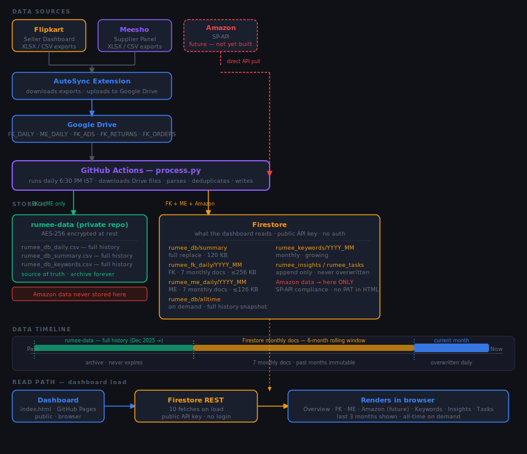

# Rumee Dashboard — Complete Project Documentation

> **Who this is for:** Any developer or AI assistant working on this project. You should be able to understand the entire system from this file without reading the code or asking the owner.
>
> **Rule:** When any decision changes, this file must be updated in the same session it changes.

Last updated: 2026-07-08 (Purchases module, Section 26 — full rework: category derived from line items, per-line tax_pct, Vendor Bill Value vs Total Landed Cost split, courier-payment mirror records, full Edit access, void/restore for both purchases and payees, short human-readable purchase IDs, QC Summary rollup, firestore.rules two-branch update rule)

---

## Table of Contents

1. [What This Project Does](#1-what-this-project-does)
2. [Three Products — How They Relate](#2-three-products--how-they-relate)
3. [Data Flow — End to End](#3-data-flow--end-to-end)
4. [Design Principle: No Local Machine](#4-design-principle-no-local-machine)
5. [Pipeline — process.py](#5-pipeline--processpy)
6. [Google Drive Authentication](#6-google-drive-authentication)
7. [GitHub Actions — Pipeline Automation](#7-github-actions--pipeline-automation)
8. [Dashboard — index.html](#8-dashboard--indexhtml)
9. [Vantage — Integration Reference](#9-vantage--integration-reference)
10. [Discord Channels](#10-discord-channels)
11. [Secrets Management](#11-secrets-management)
12. [File Structure](#12-file-structure)
13. [Amazon SP-API Integration](#13-amazon-sp-api-integration)
14. [Key Decisions](#14-key-decisions)
15. [Amazon SP-API — Full Compliance & Security Framework](#15-amazon-sp-api--full-compliance--security-framework)
16. [Data Storage Architecture — rumee-data Private Repo](#16-data-storage-architecture--rumee-data-private-repo)
17. [Flipkart API — Compliance & Security Framework](#17-flipkart-api--compliance--security-framework)
18. [Platform & Legal Compliance — Meesho, DPDP, GST, Consumer Protection](#18-platform--legal-compliance--meesho-dpdp-gst-consumer-protection)
19. [Incident Response Plan](#19-incident-response-plan)
20. [Orders Ledger](#20-orders-ledger)
21. [Product Sourcing Table](#21-product-sourcing-table)
22. [Product Vision — SaaS Suite](#22-product-vision--saas-suite)
23. [Cross-Product Interface Map](#23-cross-product-interface-map)
24. [Multi-Tenant Architecture](#24-multi-tenant-architecture)
25. [PM Discipline & Build Enforcement](#25-pm-discipline--build-enforcement)
26. [Purchases Module — Purchase / QC / Payee Tracking](#26-purchases-module--purchase--qc--payee-tracking)

---

## 1. Product Vision

**This is a generic, reusable product suite — not a tool built only for Rumee.**

Rumee Jewellery is the first business running on this system — the reference implementation. Every design decision has been made with replicability in mind. Any ecommerce seller on Flipkart, Meesho, or Amazon can plug in their own data and run the same system without writing new code.

**The three products are fully independent and multi-tenant by design:**

| Product | Generic? | What changes per business |
|---|---|---|
| Chrome Extension (AutoSync) | Yes | Google Drive folder IDs in `config.js` |
| Dashboard + Pipeline | Yes | GitHub repo, Drive folder IDs in `drive_connector.py` |
| Vantage AI Advisor | Yes | `business_profile.json` — name, stage, platforms, focus |

**Monetisation path:** Any seller can self-host for free (GitHub + Drive + Groq are all free tiers). A managed version — where we host and operate the system for other sellers — is a viable paid product built on the same codebase.

**Why this matters for development decisions:** Every feature built should work for any seller, not just Rumee. Rumee-specific config (folder IDs, webhook URLs, repo names) lives only in config files and environment variables — never hardcoded into the product code.

---

## 2. What This Repo Does

Rumee Dashboard processes raw seller data from Flipkart and Meesho, stores it in GitHub as clean CSV files, and displays it in a visual dashboard hosted on GitHub Pages. It is the data layer and UI for the full Rumee Growth System.

**Current deployment:** Rumee Jewellery (rumeein@gmail.com) — artificial jewellery on Flipkart and Meesho.

---

## 3. Three Products — How They Relate

| Product | Repo | Purpose |
|---|---|---|
| Chrome Extension (AutoSync) | rumee-auto-sync | Captures raw data from seller panels → uploads to Google Drive |
| Dashboard + Pipeline | rumee-dashboard (this repo) | Reads Drive → processes → clean DB CSVs → visual dashboard |
| Vantage | vantage-agent (generic runner) + rumee-dashboard/vantage/ (instance) | AI growth advisor — reads DB, suggests experiments, tracks outcomes |

All three are decoupled. Extension → Drive → Pipeline → GitHub → Vantage. Each step is independent.

---

## 3. Data Flow — End to End



| Step | What happens |
|---|---|
| Flipkart / Meesho panels | AutoSync Chrome extension captures raw reports → uploads to Google Drive |
| Amazon SP-API | process.py calls SP-API directly (no Drive intermediary) |
| Google Drive | Raw landing zone for FK and Meesho uploads — one file per report per day |
| process.py on GitHub Actions | Reads Drive + SP-API → processes → writes to two destinations |
| rumeein/rumee-data (private) | All DB CSVs — FK, Meesho, Amazon. AES-256 at rest. No credentials. No PII. |
| Firebase Firestore | Receives processed summaries from process.py. Dashboard reads here. |
| Dashboard (GitHub Pages) | Reads Firestore — no raw GitHub CSV URLs needed |
| Vantage | Reads rumee-data via GitHub API using PAT |
| Auto-sync | Reads rumee-data via GitHub API with PAT stored in chrome.storage |
| Local machine | Runs Chrome extension only — holds zero seller data → BitLocker not required |

---

## 4. Design Principle: No Local Machine

**Decided:** Nothing in the data processing pipeline should depend on or require the local Windows machine.

| Step | Runs where |
|---|---|
| Data capture (AutoSync extension) | Browser — user's machine, but only while capturing |
| Pipeline (process.py) | GitHub Actions — scheduled, fully cloud |
| Dashboard | GitHub Pages — static, no server |
| Vantage nightly analysis | GitHub Actions — scheduled, fully cloud |
| Vantage Discord Q&A | Cloud server (Fly.io or equivalent) — 24/7 |
| Vantage memory (experiments, learnings, activity log) | GitHub repo — committed after every write |

**Why:** Local machine = single point of failure. Everything on GitHub/cloud = nothing is lost if the PC is off, reset, or replaced.

---

## 5. Pipeline — process.py

`process.py` is the core data processing script. It:

1. Reads new files from Google Drive folders (via `drive_connector.py`)
2. Detects file type from folder ID mapping (see `drive_connector.py` → `DRIVE_FOLDERS`)
3. Parses each file (CSV/XLSX) into structured records
4. Merges with existing DB CSVs
5. Writes updated `rumee_db_summary.csv`, `rumee_db_daily.csv`, etc.
6. (Via GitHub Actions) commits and pushes updated CSVs to the repo

**Key files:**
| File | Purpose |
|---|---|
| `process.py` | Main pipeline — orchestrates all handlers |
| `drive_connector.py` | Google Drive API — fetches new files from Drive folders |
| `sheets_connector.py` | Google Sheets API — manages Orders Ledger (create, read, upsert rows) |
| `rumee_db_summary.csv` | All summary tables in one CSV (table name in column 0) |
| `rumee_db_daily.csv` | Per-SKU daily rows |
| `rumee_db_keywords.csv` | FK keyword data |
| `rumee_db_alltime.csv` | All-time cumulative |
| `pipeline_log.txt` | Per-file log: `[PASS]`/`[FAIL]`/`[WARN]`/`[SKIP]` with reason. Appended every run. |
| `pipeline_run_log.json` | Machine-readable run summary: `run_status`, `errors[]`, `warnings[]`, `stream_dates`, `stream_gaps`, `stream_status`. Read by dashboard. |
| `pipeline_dates_log.json` | Tracks which pipeline run dates each stream was last active. |

**Pipeline log format (`pipeline_log.txt`):**
- `[PASS] filename (TYPE)` — file parsed and produced rows
- `[FAIL] filename (TYPE) — ExcType: message` — parser crashed; file skipped, pipeline continues
- `[WARN] filename (TYPE) — reason` — parsed but 0 rows, or infra failure (Firestore/Discord)
- `[SKIP] filename (TYPE)` — unrecognised file type
- `[RUN_COMPLETE] pipeline — N files processed[, M FAILED][, K warnings]`
- `[FAIL_SUMMARY] filename — reason` — repeated at end of log for any failures

**`pipeline_run_log.json` key fields:**
| Field | Values | Meaning |
|---|---|---|
| `run_status` | `ok` / `warning` / `failed` | Overall health of the last run |
| `errors[]` | `[{file, type, reason}]` | Hard failures (parser crash) |
| `warnings[]` | `[{file, type, reason}]` | Zero-row results or infra issues |
| `stream_dates` | `{stream: YYYY-MM-DD}` | Latest data date per stream |
| `stream_gaps` | `{stream: [{from,to,missing_days}]}` | Date gaps detected |
| `stream_status` | `{stream: ok/partial/gap}` | Computed from live DB row counts |

**Dashboard pipeline health card (Data Pipeline tab):**
- Shows "Last run health" badge: green (ok) / orange (warnings) / red (FAILED)
- Lists each error/warning with stream type, filename, and exact reason
- Populated from `pipeline_run_log.json` via `renderPipelineHealth()` in `index.html`

**Supported data streams (handlers in process.py):**

| Stream | Platform | Status |
|---|---|---|
| ME_ORDERS | Meesho | Done |
| ME_RETURNS | Meesho | Done |
| ME_PAYMENTS | Meesho | Done |
| ME_ADS (master, summary, catalog) | Meesho | Done |
| ME_VIEWS | Meesho | Done |
| ME_CLAIMS | Meesho | Done |
| CATALOG | Meesho | Done |
| FK_PAYMENTS | Flipkart | Done |
| FK_VIEWS | Flipkart | Done |
| FK_KEYWORDS | Flipkart | Done |
| FK_LISTINGS | Flipkart | Done |
| FK_CLAIMS | Flipkart | Done |
| FK_ADS_* (daily, fsn, placements, overall, search, orders, kw) | Flipkart | Done |
| FK_ORDERS | Flipkart | Done |
| FK_RETURNS (per-date, per-SKU, courier/customer split, reasons) | Flipkart | Done |

**ME_PAYMENTS — "Order Payments" sheet column schema (`process_meesho_payments`, positional):**

| Col index | Field | Notes |
|---|---|---|
| 1 | Order Date | When the order was originally placed. Lags behind the file's own report date by days-to-weeks due to Meesho settlement delay — **not safe to use as a watermark/dedup key**, since a later file's Order Date values can be older than an earlier file's. |
| 12 | Payment Date | Equals the file's own report date on every row, every file — this is the correct chronological/monotonic key for filtering new rows and advancing `me_payments_last_date`. |
| 13 | Final Settlement Amount | The settlement value summed into `me_sett_monthly`. |

Header is a 3-row MultiIndex (`header=[0,1,2]`); falls back to `header=[0,1]` if fewer than 14 columns come back. Sheet also contains `Ads Cost` (Deduction Date is already file-aligned, no lag issue), `Referral Payments`, and `Compensation and Recovery` (logged only, not stored).

**Orders Ledger (`sheets_connector.py` + `process.py`)**

One row per order, all platforms — the single source of truth for P&L, return rates, and packaging costs. Written by the pipeline to a Google Sheet (not Firestore — 1 MB Firestore doc limit breaks at ~100 orders/day).

| Item | Value |
|---|---|
| Sheet ID | `1FqAXqC6DUva-UitesdWW-qtgRKiX7nBcSZCtRbprwI0` |
| return_receipts sheet ID | `1R5JRyFXYu-85426QwhwZpWmL_BrjLd5-BPER1T23zVY` |
| Join key (returns) | `order_id` primary, AWB fallback |
| Upsert key | `order_id` |
| Status: FK code | DONE — `build_fk_ledger_rows` + `derive_fk_sku_enrichment`; source: FK_PAYMENTS per-order rows |
| Status: ME code | DONE — `build_me_ledger_rows` + `derive_me_sku_enrichment`; source: ME_ORDERS per-order rows. `process_meesho_orders` returns 4th value (`order_rows`); `process_meesho_returns` returns 4th value (`suborder_reason_index`). ME fee breakdown (commission etc.) = 0 — Meesho does not provide per-order fee breakdown. |
| Status: AZ code | Pending — blocked on SP-API approval |
| Status: data | Flowing since the 2026-07-04 watermark bug fix (§14) — both streams confirmed processing real new rows in production (runs `28702418137`, `28703052024`) |

**Ledger columns (31):** `order_id, order_date, platform, sku, qty, gmv, settlement, commission, fixed_fee, collection_fee, shipping_fwd, shipping_rev, gst_on_fees, tcs, tds, penalty, cogs, packaging_cost, ad_spend_apport, status, zone, is_shopsy, return_reason, earring_condition, box_condition, return_loss_value, packaging_loss, claim_id, claim_status, claim_recovered, net_pl`

**net_pl formula:** `settlement − cogs − packaging_cost − ad_spend_apport − return_loss_value − packaging_loss + claim_recovered`

**Packaging loss rules:**
- Always lost: branded_poly, transparent_poly, label (flat cost from product master config)
- Bubble wrap: apply cost only for orders before discontinuation cutoff (~1 month before 2026-06-26)
- Box: lost only if `box_condition = Damaged` (from return_receipts)
- Earring/product: lost only if `earring_condition = Damaged` → `return_loss_value = COGS`

**Status update strategy:** Final statuses (Delivered, Returned-Customer, RTO, Cancelled) — stop updating. Non-final — re-check every run for 30 days, then mark Stale.

**New columns added to `fk_skus`:** `return_rate`, `rto_rate`, `net_pl`, `commission` (per-SKU totals, derived from ledger by `derive_fk_sku_enrichment`).
**New columns added to `me_skus`:** `return_rate`, `rto_rate`, `net_pl` (per-SKU totals, derived from ledger by `derive_me_sku_enrichment`).

**Replaces (drop later):** `fk_orders_daily`, `fk_orders_sku`, `fk_returns_daily`, `fk_zone_summary`, `me_state_summary`

**DO NOT use** "Order and Return" workbook (`1C9daScZzjZjEl9D4ACQzLXN6oSAfzHYime77PnW3xdU`) — discontinued.

**Product Sourcing Table (planned — not built yet)**

New tab in the Orders Ledger workbook. Tracks purchase costs for earrings, raw materials, and packaging items. Derives `cost_per_unit` per SKU and `material_unit_cost`. Used by ledger for `cogs` and `packaging_cost` fields. Dashboard write path requires a server-side backend (Firebase Function) — blocked until that is built. Dashboard will display current COGS per SKU, packaging unit costs, and purchase history.

**ME_ORDERS/ME_PAYMENTS/FK_PAYMENTS watermark bug — RESOLVED 2026-07-04.** Root cause, fix, and both backfill mechanisms are documented in §14 (Key Decisions — "Watermark pattern — dedup key must be the file's own report date, not a business date that can lag"). Fixed and verified against two real production GitHub Actions runs (commits `458882a`, `07edb42`). Full investigation trail: project memory `active.md`.

---

## 6. Google Drive Authentication

**Method: Service Account (not OAuth2)**

`drive_connector.py` uses a Google service account — a JSON key that works headlessly with no browser login required.

**Auth priority in drive_connector.py:**
1. `GOOGLE_DRIVE_CREDENTIALS` environment variable (JSON string) — used by GitHub Actions (stored as GitHub Secret)
2. `credentials.json` in project root — used for local testing

**Current state:** `credentials.json` in the repo root IS a service account key (type: `service_account`). GitHub Actions just needs this JSON stored as the `GOOGLE_DRIVE_CREDENTIALS` secret — no new Google Cloud setup required.

**The extension uses different auth:** AutoSync uses `chrome.identity.getAuthToken` (OAuth2 via Chrome) — completely separate from the pipeline auth. Do not confuse the two.

---

## 7. GitHub Actions — Pipeline Automation

**Decision:** Pipeline runs on GitHub Actions on a schedule. No local machine involvement.

**Workflow file:** `.github/workflows/process_data.yml` (already exists, already has run history)

**Schedule:** Every 6 hours (00:00, 06:00, 12:00, 18:00 UTC)

**Manual trigger options (from GitHub Actions UI):**
- `reset_db` — full reset and rebuild from scratch
- `reset_returns` — surgical FK returns backfill
- `reprocess_me_ads` — surgical Meesho ads backfill
- `generate_alltime` — regenerate the all-time data file

**Architectural decision — pipeline must NOT be triggerable from the dashboard UI:**

The dashboard (`index.html`) is a public GitHub Pages site — any secret embedded in it is readable by anyone who views source. Triggering GitHub Actions `workflow_dispatch` requires a PAT with `actions:write`. Embedding such a token in public HTML would allow any visitor to trigger pipeline runs. GitHub does not offer a scope narrower than `actions:write` for this purpose.

The safe alternative (a Firebase Cloud Function or other backend that holds the PAT server-side) adds infrastructure complexity not justified by the benefit, given that the pipeline already runs daily automatically and can be triggered manually from the GitHub Actions UI in under 30 seconds.

**Ruling: pipeline triggering from the dashboard is permanently off the table unless a secure backend is added.**

The existing `GITHUB_PAT` constant in `index.html` (used for all-time data requests) is also a known risk — it has `contents:write` scope. This should be rotated to a minimal read-only token for that specific use, or the all-time request flow should be reconsidered.

**What the workflow does:**
1. Checks out the repo
2. Installs dependencies
3. Writes `credentials.json` from `GOOGLE_DRIVE_CREDENTIALS` secret
4. Runs `python process.py --source=drive`
5. Detects if any DB CSV changed — skips commit if nothing changed
6. Commits and pushes changed files
7. Cleans up `credentials.json` (always runs, even on failure)

**GitHub Secrets needed (all already set):**
| Secret | Purpose |
|---|---|
| `GOOGLE_DRIVE_CREDENTIALS` | Service account JSON for Drive API |
| `GMAIL_USER` | Pipeline email notifications |
| `GMAIL_APP_PASSWORD` | Pipeline email notifications |

**Status: DONE — workflow live, running once daily at 6:30 PM IST (13:00 UTC).**

---

## 8. Dashboard — index.html

Single-file static dashboard hosted on GitHub Pages.

**URL:** `https://rumeein.github.io/rumee-dashboard/`

**Data loading:** `index.html` fetches CSVs from GitHub raw URLs on page load — no server, no build step, no backend.

**Current frontend stack (relevant baseline for any future redesign — see dashboard memory active.md #28, "world class and fast" redesign request from Jaiswal, 2026-07-08, not started, needs a requirements conversation first):** one file, ~8,100+ lines, all HTML/CSS/JS inline in `index.html` — no build step, no bundler, no component framework (React/Vue/etc.), no CSS preprocessor. Styling is hand-written CSS classes (`.card`, `.kpi`/`.kpi-lbl`/`.kpi-val`, `.pur-badge`, `.btn-primary`/`.btn-ghost`, etc.) with some duplication across eras (e.g. two separate KPI-card styling systems coexist, see context.md "index.html Code Patterns"). Vanilla JS throughout, no framework state management — global `D` object + a growing set of `window._xxx` module-scoped globals per feature area (Purchases, Products, etc.). Any "fast" redesign goal needs to decide explicitly whether it means visual/perceived polish (achievable within this architecture) or actual load/parse/render performance (would likely require splitting the single file / adding a real build step, a bigger architectural change, not a re-skin).

**Tabs:**
| Tab | What it shows |
|---|---|
| Master | Combined view — GMV, orders, returns across platforms |
| Flipkart | FK monthly + SKU + ads data |
| Meesho | ME monthly + SKU + views + return reasons |
| Amazon | Placeholder — not built. `az_monthly` schema ready. SP-API registration under review (2026-06-22). |
| Tasks | Open tasks, pulled from Firebase Firestore |
| Dev | Removed 2026-06-26 (commit f510433) — tracking moved to Claude memory |
| Data Pipeline | 15 data streams, gap detection, Vantage wishlist badge |
| Returns | Returns reconciliation tab — spec written, not built |

**Global build badge (added 2026-07-05):** `#siteBuild` span in the main `<header class="site-hdr">`, visible on every tab. Format `BUILD YYYY-MM-DD HH:MM`, hardcoded — manually bumped on every push touching `index.html` so Jaiswal can visually confirm (compare the badge string) whether a push is actually live vs. still cached by GitHub Pages/the browser. Same convention as the pre-existing Returns Scanner `#ret-build` badge, generalized to the whole dashboard.

**Reassign — two distinct levels, do not conflate (critical, see 2026-07-05 incident below):**
| Function | Scope | What it moves |
|---|---|---|
| `reassignVariationPrompt()` / `pmWrite('reassign_variation')` | Whole `product_master` doc | ALL listings on the doc, then deletes the source doc |
| `reassignListingPrompt()` / `pmWrite('reassign_listing')` | One listing inside a doc's `listings[]` | Only that one listing (by `product_id`\|\|`catalog_id`); every other listing on the source doc is untouched; source doc is only deleted if left with zero listings |

**2026-07-05 incident:** a per-listing "Reassign" button (in `buildListingRow`, next to each individual listing row) was mistakenly wired to `reassignVariationPrompt` (the whole-doc function) instead of a genuine per-listing one. Clicking Reassign on ONE listing inside a multi-listing product moved ALL of that product's listings to the target and deleted the source doc — not just the one listing clicked. Data was not permanently lost (everything moved together), but this was a serious near-miss. Fixed same day by building the actual `reassign_listing` action described above. **Lesson: any future "per-listing" UI action must call a function whose write path genuinely operates on one `listings[]` entry — never reuse the whole-doc reassign/delete path for a per-listing button.**

**Products tab — label-based architecture (superseded the slug/FSN-map design below, live since 2026-07-03; UI redesign + platform filter added 2026-07-04)**

`product_master` is now one Firestore doc per **Design + Variation** label folder (doc id = folder name, e.g. `DJ-7_Bahubali`), not one doc per platform SKU slug. Each doc has an embedded `listings[]` array — every Meesho/Flipkart/Shopsy/Amazon listing for that design+variation lives in the same doc, keyed for dedup by `product_id`-or-`catalog_id` (Meesho is keyed by `product_id` specifically, since one Meesho catalog page can hold several genuinely distinct products). `pm_overrides` (one doc per raw platform SKU) is the manual mapping table that tells the pipeline which label folder each SKU belongs to; unmapped SKUs land in `needs_review` for manual assignment via the dashboard — never auto-guessed by keyword matching (an earlier auto-classifier existed and was deleted 2026-07-03).

Catalog UI, 3 levels: **Design** (card, expand/collapse) → **Variation** (sub-row, e.g. "Bahubali"/"OG"/"Bangle-4") → **Listing** (one table row per platform SKU). Within an open variation, listings are grouped by platform with a plain label line above each block ("Meesho · 2 listings" — not a legend, not collapsible; rows always stay flat/visible so duplicate/over-listed products across platforms are visible at a glance), sorted by SKU ID within each platform's block.

**Listing row columns:** Listing (name + Cat/FSN/ASIN id), Stock, Status (icon, tooltip carries the real reason — Low stock/Suggested inactive/OOS/Inactive), Price, Settle, Cost, Quality, Buyer link (editable, saves on blur), open-in-new-tab button, Updated. Price/Settle/Cost/Quality currently render as visible "not tracked"/"coming soon" placeholders — no per-listing data source exists yet for them (sales data is aggregated by SKU across platforms, not joined per listing; Cost needs the planned Product Sourcing Table §21; `listing_quality` is always null). Buyer-link save shows a real Saving…/Saved/Failed-retry indicator (`_pmSetSaveState()`) — `fbPatch`/`fbWriteListings` return the fetch `Response` so a real write failure is visible instead of silently swallowed.

**Filters (apply together):**
- Status: Needs attention / All / Active / Out of stock / Inactive — design-level (does this design have at least one healthy listing), separate from the per-row Status icon which is listing-level.
- **Platform (added 2026-07-04):** All platforms / Meesho / Flipkart / Amazon / Shopsy (`setPmPlatformFilter()`, `window._pmPlatformFilter`). Applies throughout the tab: hides designs/variations with no listing on the selected platform, recomputes the "Platforms" pill counts to the filtered platform only, shows only that platform's rows when a variation is expanded, and filters Needs Review by the same control.
- Universal search box (design/variation/SKU/catalog/product ID, covers both Catalog and Needs Review), Rows/page (10–All, shared control, independent pagination per list), Expand all/Collapse all.

**Container width:** Products tab content sits in its own inline-styled div (not the shared `.page{max-width:1440px}` class other tabs use) — currently `max-width:1152px` (widened +20% from 960px, 2026-07-04), scoped only to this tab.

**Pipeline hardening (2026-07-04):** `load_pm_overrides()` no longer swallows a Firestore/credentials failure into an empty `{}` (which used to make every catalog/listing row look "unmapped" and flood `needs_review`). A load failure now sets `pm_overrides_load_failed`, skips CATALOG/FK_LISTINGS/Amazon product_master processing for that run entirely (affected files retry automatically next run), and fires a Discord alert (`send_discord_pm_overrides_alert`) instead of failing silently.

**Known open gap:** Shopsy sub-channel listings appear to have been excluded from the original migration's `pm_overrides` mapping — confirmed in two independent runs (2026-07-04) that 100% of a sample FK_LISTINGS file's unmapped rows were `platform=shopsy`. Needs a manual backfill decision, tracked in dashboard project memory, not yet resolved.

**Pipeline write-ownership fix (2026-07-09, commits `200ff73` + `5345232`):** `pm_overrides` is immutable once written (`firestore.rules`: `allow update/delete: if false` — deliberate 2026-07-02 hardening so the public dashboard can never rewrite a mapping decision). Rename/Reassign in the dashboard correctly moves a listing's doc in `product_master`, but has no way to also update `pm_overrides` to match. Before this fix, every pipeline run re-trusted `pm_overrides`' stale target and silently resurrected the listing back at its old location — duplicating it alongside wherever it had been manually moved to (confirmed live: Lotus Jhumka + Combo sub-types kept reappearing in their old buckets). Fix: `write_product_master_ids`/`write_az_product_master` now build a listing-ownership index from the `product_master` snapshot they already load each run, and redirect a listing's update to wherever it *currently* lives instead of wherever `pm_overrides` implies — current placement always wins; `pm_overrides` still governs any listing never seen in `product_master` before. A same-batch side effect surfaced during review of `200ff73` and was fixed separately in `5345232`: the two-pass restructuring dropped a mid-loop label refresh, so two brand-new SKUs sharing one design+variation within the same pipeline run could each get their own new doc instead of merging into one — `label_index` is now updated the instant a brand-new doc's label is decided, restoring the merge. Needs Review Assign's free-text Design/Variation inputs were also replaced with dropdowns of existing values + an explicit "+ Add new" option (with near-duplicate detection) — the other half of the same fragmentation root cause, since typo'd/near-miss free text was how designs fragmented in the first place. One-time cleanup of the ~41 listings already duplicated before this fix is deferred, pending Jaiswal's corrected Excel — not touched automatically.

<details>
<summary>Superseded design (pre-2026-07-03, kept for history)</summary>

Old architecture: one `product_master` doc per platform-SKU slug (`sku_id` = `me_sku_id()`/`fk_sku_id()` slug), FSN/catalog-ID patched onto matching docs via `write_product_master_ids(fk_fsn_map, me_catalog_ids)`, an `autoSyncListingsToProductMaster()` auto-classifier that created needs_review docs client-side. All replaced by the label-based rebuild — `filterPmCatalog()`, `clearPmFilters()`, `autoSyncListingsToProductMaster()`, `syncFkFsnToProductMaster()`, `autoPopulateFkUrls()`, `skuRow()` no longer exist in the codebase.

Commits (historical): `7899211` (initial build), `1da3916` (table layout), `5d31b6e` (FSN/CatID + filters + font), `a811e16` (pipeline extraction), `191758b` (full Me catalog seeding).

</details>

**Commits:** `7899211` (initial build), `1da3916` (table layout), `5d31b6e` (FSN/CatID + filters + font), `a811e16` (pipeline extraction), `191758b` (full Me catalog seeding)

---

**Backend storage:** Firebase Firestore (Spark plan, free, never pauses)
- Project ID: stored in `index.html` constants
- Used for: Tasks, Insights (not for DB data — that's GitHub CSVs)

---

## 9. Vantage — Integration Reference

Vantage is a separate project (`D:\vantage-agent\`). Full documentation: `D:\vantage-agent\DOCS.md`.

**What this repo provides to Vantage:**

| Resource | How Vantage reads it |
|---|---|
| Summary DB (fk_monthly, me_monthly, fk_skus, me_skus, etc.) | Firestore `rumee_db/summary` — public REST API |
| FK daily rows | Firestore `rumee_fk_daily/{YYYY_MM}` — public REST API |
| ME daily rows (orders_placed, delivered, rto per SKU per day) | Firestore `rumee_me_daily/{YYYY_MM}` — public REST API |
| FK real fulfilment orders | Firestore `rumee_orders_daily/{YYYY_MM}` — public REST API |
| FK Ads placements | Firestore `rumee_fk_ads_placements/{YYYY_MM}` — public REST API |
| FK Ads order items | Firestore `rumee_fk_ads_order_items/{YYYY_MM}` — public REST API |
| Meesho Ads daily | Firestore `rumee_me_ads_daily/{YYYY_MM}` — public REST API |
| Meesho Ads catalog | Firestore `rumee_me_ads_catalog/{YYYY_MM}` — public REST API |
| Pipeline health | `pipeline_run_log.json` — file in this repo, read by `brief_builder.py` |

**Note:** GitHub raw CSV URLs for `rumee_db_summary.csv` / `rumee_db_daily.csv` were removed from this repo on 2026-06-25 (commit 66d3427). All data access is now via Firestore only.

For how Vantage reads and uses this data, see `D:\vantage-agent\DOCS.md`.

Vantage writes memory files back into this repo at `vantage/memory/` — committed and pushed after every run.

---

## 10. Discord Channels

| Channel | Who sends | Webhook stored in | Status |
|---|---|---|---|
| #pipeline | `process.py` via GitHub Actions | `rumee_secrets.py → DISCORD_WEBHOOK_URL` | Live |
| #auto-sync | rumee-auto-sync extension (`background.js`) | `secrets.js → DISCORD_WEBHOOKS.AUTO_SYNC` | Live |
| #dashboard | Nothing yet — webhook registered 2026-06-27 | `secrets.js → DISCORD_WEBHOOKS.DASHBOARD` | Webhook ready, events TBD |

**Dashboard channel rule:** index.html is a public page — the webhook URL cannot be embedded in it. Any dashboard notification must be sent from `process.py` (pipeline) or the extension (`background.js`). Candidate events: insights generated, Firestore task created, stale data warning.

---

## 11. Secrets Management

**All secrets live in `rumee_secrets.py`** — a single file that is gitignored and never committed. It exists only on the local machine.

### File: `rumee_secrets.py` (gitignored — local only)

```python
FIREBASE_API_KEY = 'AIzaSy...'          # Firebase web API key (Firestore access)
DISCORD_WEBHOOK_URL = 'https://...'     # #pipeline channel webhook
FLIPKART_API_SECRET = '12b66...'        # Flipkart Seller API secret (server-side use)
```

### File: `rumee_secrets.example.py` (committed — placeholder values only)

Template for setting up on a new machine. Copy to `rumee_secrets.py` and fill in real values.

### How each secret is used

| Secret | Used by | How |
|---|---|---|
| `FIREBASE_API_KEY` | `seed_product_master.py` | `from rumee_secrets import FIREBASE_API_KEY` |
| `DISCORD_WEBHOOK_URL` | `process.py` (pipeline summary + wishlist functions) | `from rumee_secrets import DISCORD_WEBHOOK_URL` |
| `FLIPKART_API_SECRET` | Future `process.py` FK API integration | `from rumee_secrets import FLIPKART_API_SECRET` |

### Firebase API key in `index.html`

`index.html` also contains the Firebase API key (line ~1815) hardcoded. This is **intentional and correct** — it is a client-side web API key, public by design. Firebase security is enforced by Firestore Security Rules, not by hiding the key. GitHub secret scanning flags it as a false positive — dismiss the alert in GitHub's Security tab.

### Setting up on a new machine

```
1. Copy rumee_secrets.example.py → rumee_secrets.py
2. Fill in real values (get from Jaiswal or password manager)
3. Never commit rumee_secrets.py
```

### Why this pattern exists

Before June 2026, secrets were hardcoded in `seed_product_master.py` and `process.py` and committed to the public GitHub repo. GitHub Secret Scanning and GitGuardian flagged them repeatedly. After the third incident, all secrets were moved to this gitignored file pattern permanently.

---

## 11. File Structure

```
rumee-dashboard/
├── index.html              — full dashboard (single file)
├── process.py              — pipeline: reads Drive, writes DB CSVs
├── drive_connector.py      — Google Drive API wrapper (service account auth)
├── rumee_db_summary.csv    — all summary tables
├── rumee_db_daily.csv      — per-SKU daily rows
├── rumee_db_keywords.csv   — FK keyword data
├── rumee_db_alltime.csv    — all-time cumulative
├── credentials.json        — service account key (gitignored)
├── rumee_secrets.py        — all secrets: Firebase key, Discord #pipeline webhook, FK API secret (gitignored — local only)
├── rumee_secrets.example.py — template with placeholder values (committed)
├── DOCS.md                 — this file (single source of truth)
├── vantage/
│   ├── business_profile.json   — Vantage config for Rumee instance
│   ├── .env                    — GROQ_API_KEY, DISCORD_BOT_TOKEN (gitignored)
│   └── memory/
│       ├── experiments.json
│       ├── learnings.json
│       └── activity_log.jsonl
└── rumee-extension/
    ├── DOCS.md             — extension documentation (needs committing)
    └── ...
```

---

## 12. Build Status

| Component | Status |
|---|---|
| Extension — Flipkart + Meesho capture | Done |
| Extension — Amazon | Not started |
| Pipeline — Drive API + all ME handlers | Done |
| Pipeline — FK core handlers (payments, views, keywords, listings, claims) | Done |
| Pipeline — FK_ADS_*, FK_ORDERS | Pending |
| Pipeline — FK_RETURNS reasons | Done |
| Pipeline on GitHub Actions (service account auth) | **Done (2026-06-20) — needs GOOGLE_DRIVE_CREDENTIALS secret added** |
| Dashboard — core metrics (FK + ME) | Done |
| Dashboard — Returns tab | Spec written, not built |
| Dashboard — Deep Dive tab (experiment board) | Design done, not built |
| Vantage — runner, context builder, LLM, Discord bot | Done |
| Vantage — data standardization (fk_skus rename) | Done (2026-06-20) |
| Vantage — context_builder reads from GitHub URLs | Done (2026-06-20) |
| Vantage — memory writes to GitHub repo | Done (2026-06-20) |
| Vantage — nightly run on GitHub Actions | **Not yet implemented** |
| Vantage — Discord Q&A on cloud server (24/7) | **Not yet implemented** |
| Vantage — eval loop (automated training) | Not started — after GitHub Actions |

---

## 13. Amazon SP-API Integration

### Official Documentation — Read Before Any SP-API Work

| Resource | URL | Use for |
|---|---|---|
| Registering your application | https://developer-docs.amazon.com/sp-api/docs/registering-your-application | Production app registration, full onboarding steps |
| Onboarding Step 7 — Register Production App | https://developer-docs.amazon.com/sp-api/docs/onboarding-step-7-register-your-first-production-application | Exact steps to create production app client |
| Self-authorization (get refresh token) | https://developer-docs.amazon.com/sp-api/docs/self-authorization | How to authorize your own seller account and get refresh token |
| View app credentials | https://developer-docs.amazon.com/sp-api/docs/viewing-your-application-information-and-credentials | Where to find LWA client ID and client secret |
| SP-API onboarding overview | https://developer-docs.amazon.com/sp-api/docs/sp-api-registration-overview | Full 10-step onboarding sequence |
| Policies and agreements | https://developer-docs.amazon.com/sp-api/docs/policies-and-agreements | DPP, AUP, Solution Provider Agreement |
| FAQs | https://developer-docs.amazon.com/sp-api/page/faqs | Common questions |
| Solution Provider Portal | https://solutionproviderportal.amazon.com | Developer portal — app management, credentials |
| App Integrations (notifications) | https://developer-docs.amazon.com/sp-api/docs/app-integrations | Send notifications to sellers via Seller Central — **not relevant for our use case** (internal dashboard only, no Seller Central notifications needed) |

> **Rule:** Before any SP-API action — endpoint call, credential rotation, app change — read the relevant doc above first. No guessing, no experimenting.

### Registration Status (as of 2026-06-27)

| Item | Status |
|---|---|
| Developer portal | [solutionproviderportal.amazon.com](https://solutionproviderportal.amazon.com) |
| Account type | Private developer (our own store only — no Appstore listing needed) |
| Portal account | A1BFD2L65UOSBW |
| Developer profile | **APPROVED** 2026-06-27 (case 20957051271) |
| Cases | 20919833741 (rejected), 20937612211 (re-submit instruction), 20957051271 (approved) |

### Apps

| App name | App ID | Status |
|---|---|---|
| Rumee Dashboard Production | `amzn1.sp.solution.bf75a5ec-9b3a-4693-a2a8-d561832cccc0` | **Draft** — self-authorization pending |
| Rumee Dashboard | `amzn1.sp.solution.2f7d6de2-749e-4962-8849-d935e040df62` | Sandbox |

### LWA Credentials — Production App

| Item | Value |
|---|---|
| Client ID | `amzn1.application-oa2-client.008a8a63793b4567af58a6a8ffb00430` |
| Client Secret | Stored in `rumee_secrets.py` + GitHub Secrets (`AMAZON_LWA_CLIENT_SECRET`) |
| **Rotation deadline** | **2026-12-24** — rotate before this date or API access will break |
| Dashboard reminder | Must alert 21 days before = **2026-12-03** |

> **Rotation procedure:** Portal → Rumee Dashboard Production → View LWA credentials → Rotate secret → update `rumee_secrets.py` and GitHub Secrets immediately.

### Roles Requested

| Role | Purpose |
|---|---|
| Product Listing | Create/update listings, manage A+ content |
| Pricing | Monitor and update product prices |
| Buyer Communication | Respond to return requests and customer queries |
| Buyer Solicitation | Request reviews and feedback post-order |
| Selling Partner Insights | Account performance, account health data |
| Finance and Accounting | Settlement reports, revenue statements |
| Inventory and Order Tracking | Order status, stock levels |
| Brand Analytics | Sales and inventory analytics for restocking decisions |

### Security Commitments Made to Amazon

These were declared in the Solution Provider Profile on 2026-06-27 (re-submission). **These are binding commitments — they must be maintained and monitored.**

| Commitment | What it means in practice |
|---|---|
| Firewalls, anti-virus, network security | Windows Defender active on all machines handling Amazon data. Router firewall enabled. |
| Access restricted by job role | Only the owner (Jaiswal) accesses Amazon data — no shared credentials |
| Amazon data encrypted in transit | All API calls over HTTPS only. Dashboard on GitHub Pages (HTTPS only). No HTTP. |
| Security incidents reported within 24 hours | Any breach or unauthorised access must be reported to security@amazon.com within 24 hours — see Section 19 |
| Credentials stored securely | All credentials in gitignored `rumee_secrets.py` — never committed to GitHub. No hardcoding. |
| No third parties receive Amazon data | Amazon data stays internal — never shared with external services except GitHub (hosting) |
| No external non-Amazon sources for Amazon data | Amazon data comes only from SP-API — no scraping, no third-party data providers |

### What Amazon Data Will Flow Into

- `az_monthly` table in `rumee_db_summary.csv` — schema already defined in `process.py`
- Columns: `month | label | gmv | orders | ad_spend`
- Dashboard Amazon tab: placeholder exists in `index.html` — not yet built

### Next Steps

1. Portal → "+ Add new app client" → set Application type = **Production** → Save and exit
2. View LWA credentials for the Production app → copy Client ID and Client Secret
3. Portal → Authorize application → "Authorize app" → copy Refresh Token
4. Store in GitHub Secrets: `AMAZON_LWA_CLIENT_ID`, `AMAZON_LWA_CLIENT_SECRET`, `AMAZON_REFRESH_TOKEN`
5. Build SP-API handler in `process.py` to populate `az_monthly`
6. Build Amazon tab UI in `index.html`

### Programmatic Security Monitoring (pending — separate session)

A monitoring system must be built to verify all security commitments above are being met. Failures must trigger immediate Discord notification. This is a separate session task — see memory for spec.

---

## 15. Amazon SP-API — Full Compliance & Security Framework

> **Why this section exists:** This is the authoritative record of every legal and security obligation that comes with our Amazon SP-API access. It is the single place to check before any Amazon integration decision. Never let a session pass without reading this if Amazon data is being touched.
>
> **Policy baseline:** Amazon Data Protection Policy (DPP) + Acceptable Use Policy (AUP) + Solution Provider Agreement — effective November 25, 2025. All three are binding. Continued use of SP-API = acceptance.
>
> **Source:** [Amazon SP-API Policies and Agreements](https://developer-docs.amazon.com/sp-api/docs/policies-and-agreements)

---

### 15.1 Policies That Bind Us

| Policy | What it covers | Link |
|---|---|---|
| Data Protection Policy (DPP) | How Amazon data must be stored, encrypted, retained, and deleted | [DPP](https://developer-docs.amazon.com/sp-api/docs/policies-and-agreements) |
| Acceptable Use Policy (AUP) | What we can and cannot do with Amazon data | [AUP](https://developer-docs.amazon.com/sp-api/docs/policies-and-agreements) |
| Solution Provider Agreement | Legal terms — termination, modifications, liability | [Agreement](https://developer-docs.amazon.com/sp-api/docs/policies-and-agreements) |

---

### 15.2 Data Classification

Amazon data we will access falls into two categories with different rules:

| Category | Definition | Examples | Retention Limit |
|---|---|---|---|
| PII (Personally Identifiable Information) | Data that can identify a buyer | Buyer name, address, phone, email | **30 days after order delivery** |
| Non-PII | Business/operational data | Order totals, GMV, ad spend, impressions | **18 months maximum** |

**For Rumee specifically:**
- `az_monthly` table stores aggregated GMV, orders, ad_spend — no PII. 18-month cap applies.
- If we ever access buyer addresses or names via the Orders API — RDT required + 30-day deletion.

---

### 15.3 Restricted Data Tokens (RDT) — PII Access Rules

Certain SP-API operations return PII and are **restricted operations**. They require a Restricted Data Token (RDT) — not just a standard LWA access token.

**How to get an RDT:** Call `createRestrictedDataToken` via the Tokens API, passing the LWA token. Use the RDT in `x-amz-access-token` header for that call only.

**Rules:**
- RDTs cannot be used for standard (non-restricted) API calls
- RDTs must be handled with the same security as credentials
- PII obtained via RDT must be deleted within 30 days of order delivery
- PII must be encrypted at rest (AES-128+) if stored at all during those 30 days

**Affected roles we hold:**
| Role | May involve PII? | Action |
|---|---|---|
| Inventory and Order Tracking | Yes — buyer address in orders | Use RDT; delete within 30 days |
| Buyer Communication | Yes — buyer contact info | Use RDT; delete within 30 days |
| Buyer Solicitation | Yes — buyer contact info | Use RDT; delete within 30 days |
| Finance and Accounting | No — settlement data only | Standard LWA |
| Brand Analytics | No — aggregated analytics | Standard LWA |
| Selling Partner Insights | No — account performance | Standard LWA |
| Product Listing | No — catalog data | Standard LWA |
| Pricing | No — price data | Standard LWA |

**Rule: Do NOT store buyer names, addresses, or contact details in any CSV, Firestore, or GitHub file. Pull them on-demand with RDT and discard.**

---

### 15.4 Acceptable Use — What We CANNOT Do

| Prohibited | Detail |
|---|---|
| Share Amazon data with third parties | Data stays internal. Not passed to any external service, tool, or person. |
| Use non-Amazon sources for Amazon data | All Amazon data comes from SP-API only — no scraping, no third-party providers |
| Store Amazon data on personal devices | No phone storage, no personal laptop, no removable USB |
| Store PII on removable media without encryption | AES-128+ mandatory if ever done |
| Use generic/shared/default credentials | Every account must have unique credentials |
| Leave vulnerabilities unpatched | Critical: fix within 7 days. High: fix within 30 days. |
| Disable antivirus software | Windows Defender must stay active and cannot be user-disabled |
| Use LWA tokens to retrieve PII (deprecated) | LWA tokens no longer retrieve PII — must use RDT (discontinued Nov 2024) |

---

### 15.5 Security Controls — Full Requirements vs Our Status

#### Authentication & Passwords

| Requirement | Standard | Our Status | Action Needed |
|---|---|---|---|
| Password complexity | Min 12 chars, mixed case, numbers, special chars, no username components | Verify for Amazon Seller Central + developer portal | Audit passwords |
| Password history | Cannot reuse last 10 passwords | Verify | |
| Password max age | 365 days | Verify | |
| MFA | Mandatory — TOTP, hardware token, or biometric | Enable on Seller Central + developer portal | Enable MFA |
| Account lockout | Max 10 failed attempts | Platform-enforced (Amazon side) | N/A — Amazon enforces |
| API key rotation | Annual minimum, with automated processes | Not yet scheduled | Schedule annually |

#### Credential Storage

| Requirement | Standard | Our Status |
|---|---|---|
| No hardcoded credentials | Never in source code | Done — rumee_secrets.py pattern |
| Encrypted credential storage | AES-128 minimum | Done — OS-level encryption (Windows) |
| No plain text API keys | Never exposed in logs or output | Review process.py + index.html |
| Credentials in gitignored file | Must not be committed | Done — rumee_secrets.py gitignored |

#### Network & Encryption in Transit

| Requirement | Standard | Our Status |
|---|---|---|
| TLS version | TLS 1.2 minimum | Done — GitHub Pages + SP-API both enforce |
| Firewall | Network firewalls required | Done — router firewall active |
| Anti-malware | Antivirus on all systems accessing Amazon data | Done — Windows Defender |
| Monthly anti-malware updates | Defender signatures updated monthly minimum | Windows auto-updates — verify is on |
| IDS/IPS | Intrusion detection/prevention | Windows Defender covers this for our scale |
| Network segmentation | VLANs or subnets for isolation | N/A — home network; Defender + firewall sufficient for private developer |

#### Encryption at Rest

| Requirement | Standard | Our Status | Action |
|---|---|---|---|
| PII encryption | AES-128+ or RSA-2048+ | No PII stored at rest (aggregated only) | Maintain — never store PII |
| Key encryption at rest | AES-128+ | OS-level BitLocker on Windows | Verify BitLocker is on |
| Backup encryption | AES-128+ | GitHub repo is the backup — HTTPS + GitHub's encryption | Covered |

#### Data Retention

| Data Type | Limit | Our Policy | Status |
|---|---|---|---|
| PII | 30 days post-delivery | Do not store PII at all | Compliant |
| Non-PII (az_monthly etc.) | 18 months maximum | az_monthly: rolling aggregated data | Must implement 18-month purge |
| Security logs | Minimum 12 months | GitHub Actions logs retained by GitHub | Verify retention settings |
| Deleted data method | NIST 800-88 compliant | GitHub delete = acceptable (API delete) | Compliant |

#### Logging & Monitoring

| Requirement | Frequency | Our Status | Action |
|---|---|---|---|
| Log retention | 12 months minimum | GitHub Actions logs | Check GitHub log retention settings |
| Log review | Bi-weekly OR real-time automated | Not implemented | Add to 6-month review checklist |
| Required log fields | Timestamps, user IDs, access events, errors | GitHub Actions provides this | Covered |
| Monitor API calls | Watch for unexpected request rates | Not implemented | Check SP-API usage monthly in developer portal |
| Monitor for data exfiltration | Dark web / anomaly detection | N/A — small private developer | Scope: monitor GitHub for secret leaks |

#### Vulnerability Management

| Requirement | Frequency | Our Status | Action |
|---|---|---|---|
| Vulnerability scans | Monthly minimum | Not implemented | Use GitHub Security Alerts — review monthly |
| Penetration testing | Annual | N/A — no external-facing app | Scope: private developer, SP-API is not a public service |
| Code scanning | Before each release | GitHub Secret Scanning active | Extend to dependency audit |
| Critical vuln fix | 7 days | Not tracked | Track via GitHub Security tab |
| High-risk vuln fix | 30 days | Not tracked | Track via GitHub Security tab |

#### Incident Response

| Requirement | Standard | Our Status |
|---|---|---|
| Incident response plan | Must exist, reviewed every 6 months | Done — Section 19 of this document |
| Amazon notification | Within 24 hours to security@amazon.com | Documented in Section 19 |
| Incident Management POC | Must be designated and available | Jaiswal — rumeein@gmail.com |
| Next plan review | Dec 2026 | Scheduled |

---

### 15.6 Operational Calendar — What We Must Do and When

This is the master checklist. Run through this at every 6-month plan review (June + December).

#### Monthly
- [ ] Check GitHub Security Alerts — any exposed secrets or dependency vulnerabilities
- [ ] Check SP-API developer portal — review API call logs for unexpected activity
- [ ] Verify Windows Defender is running and definitions are current (Windows Update)

#### Quarterly
- [ ] Review `az_monthly` data — verify no PII fields have crept in
- [ ] Check GitHub Actions run logs — any failures or unexpected patterns

#### Annually (June + December review)
- [ ] Rotate SP-API LWA Client Secret (in developer portal → Rumee Dashboard app)
- [ ] Rotate Firebase API key (Google Cloud Console)
- [ ] Rotate GitHub Personal Access Token / RUMEE_DATA_TOKEN (GitHub Settings → Developer Settings)
- [ ] Rotate GROQ_API_KEY
- [ ] Rotate Flipkart API secret (seller.flipkart.com → Developer Access)
- [ ] Verify rumee_secrets.py is NOT in any commit (`git log -S "FIREBASE_API_KEY" --all`)
- [ ] Verify Windows Defender is active
- [ ] Verify no Amazon data on local machine (rumee-data architecture maintained)
- [ ] Document GitHub as approved vendor (one-line entry in this section) — Amazon subcontractor requirement
- [ ] Verify no Amazon or FK data shared with any third party
- [ ] Review Section 19 (Incident Response Plan) — update if anything changed
- [ ] Verify `az_monthly` data older than 18 months is purged
- [ ] Check that MFA is enabled on: Amazon Seller Central, Amazon developer portal, GitHub, Firebase Console, Flipkart Seller Hub

---

### 15.7 PII Decision Tree — Before Touching Any Order Data

Before writing any code that calls an SP-API operation:

```
Does this API call return buyer name, address, phone, or email?
│
├── YES → STOP. Requirements:
│         1. Obtain RDT via createRestrictedDataToken
│         2. Use RDT in x-amz-access-token header (not LWA token)
│         3. Do NOT store this data in any CSV, Firestore, or GitHub file
│         4. If you must store temporarily: AES-128+ encryption, 30-day deletion
│         5. Log that PII was accessed (timestamp, purpose)
│
└── NO → Standard LWA token is fine.
         Store in az_monthly / GitHub CSVs is fine.
         18-month retention cap applies.
```

---

### 15.8 What "No Third-Party Sharing" Means in Practice

| System | Does it receive Amazon data? | Verdict |
|---|---|---|
| GitHub repo (rumee-data — private) | Yes — az_monthly aggregated non-PII | OK — AES-256 at rest, private, access-controlled. Researched and confirmed compliant. |
| GitHub repo (rumee-dashboard — public) | No Amazon data in public repo | OK |
| GitHub Pages (index.html) | Reads from Firestore / GitHub APIs | OK — it's our own dashboard |
| Firebase Firestore | No Amazon data | OK |
| Groq (Vantage) | Only if we pass az_monthly to context | Verify: aggregated non-PII data is OK; never pass PII to Groq |
| Discord (Vantage bot) | Only aggregated summary stats | OK — no PII, no individual order data |
| Google Drive | No Amazon data flows here | OK |
| Any analytics tool | Never | Prohibited |
| Any competitor | Never | Prohibited |

---

### 15.9 Security Gaps — Known Issues (Update as resolved)

| Gap | Risk | Action | Priority |
|---|---|---|---|
| MFA status on Amazon accounts not confirmed | High — credential theft | Enable TOTP on Seller Central + developer portal | **Immediate** |
| BitLocker not active on local machine | **RESOLVED via architecture** — see Section 16. Local machine will hold no Amazon data. rumee-data private repo (GitHub AES-256) handles encryption at rest. | No local action needed | Closed |
| API key rotation not scheduled | Medium — stale credentials | Add to December 2026 review | December 2026 |
| Log review cadence not established | Medium | Add to monthly checklist | Next review |
| az_monthly 18-month purge not implemented | Low (no data yet) | Add to process.py when az_monthly has data | When SP-API live |
| GitHub Actions log retention not verified | Low | Check GitHub → Settings → Actions | Next review |
| Security monitoring system not built | Medium | Separate session — automated checks | Active item #9 in memory |

---

### 15.10 Reference Links (All Official)

| Document | URL |
|---|---|
| Policies & Agreements index | https://developer-docs.amazon.com/sp-api/docs/policies-and-agreements |
| Security & Compliance Overview | https://developer-docs.amazon.com/sp-api/docs/security-compliance-overview |
| Key Security Control Guidance | https://developer-docs.amazon.com/sp-api/docs/guidance-to-address-key-security-controls-in-sp-api-integration |
| Network Protection Guidance | https://developer-docs.amazon.com/sp-api/docs/guidance-for-network-protection-in-sp-api |
| Data Encryption & Recovery | https://developer-docs.amazon.com/sp-api/docs/protecting-amazon-api-applications-data-encryption-and-recovery |
| Restricted Data Token Guide | https://developer-docs.amazon.com/sp-api/docs/authorization-with-the-restricted-data-token |
| SP-API Guard (compliance scanner) | https://developer.amazonservices.com/guard |
| Policy changelog (Nov 2025) | https://developer-docs.amazon.com/sp-api/changelog/updates-to-the-data-protection-policy-and-acceptable-use-policy |

---

## 14. Key Decisions

| Decision | What was decided | Date |
|---|---|---|
| No local machine in pipeline | Pipeline runs on GitHub Actions. Nothing requires the local PC after data capture. | 2026-06-20 |
| DB storage — new architecture | Move all DB CSVs (FK, Meesho, Amazon) to **rumee-data** (private GitHub repo). Replaces public rumee-dashboard CSV storage. COMPLETE — CSVs removed from public repo 2026-06-25 (commit 66d3427). See Section 16. | 2026-06-25 |
| Raw data storage | Google Drive — extension uploads directly, organised by folder per stream | — |
| Drive auth | Service account (`credentials.json`) — works headlessly. Already in place. GitHub Actions uses `GOOGLE_DRIVE_CREDENTIALS` secret. | — |
| Pipeline trigger | GitHub Actions on schedule (daily) — no manual step | 2026-06-20 |
| Vantage data source | Reads from GitHub raw URLs (same CSVs as dashboard). No local file access. | 2026-06-20 |
| Vantage memory | experiments.json, learnings.json, activity_log.jsonl committed to GitHub repo after every write | 2026-06-20 |
| LLM for Vantage | Groq (free) — llama-3.3-70b-versatile | — |
| Vantage 24/7 | Discord Q&A bot hosted on cloud server (Fly.io or equivalent). Nightly audit via GitHub Actions. | 2026-06-20 |
| fk_skus columns | Renamed in context_builder for clarity — ad_revenue → ad_attributed_revenue_rs, conversions → units_sold_via_ads, stock dropped | 2026-06-20 |
| fk_skus — ad_spend + roas added | process.py now accumulates ad_spend per SKU from FK_ADS_CAMPAIGN files and stores it in fk_skus alongside roas (ad_revenue/ad_spend). Vantage brief_builder updated to show ROAS per SKU. Previously ROAS existed in fk_ads_daily/fk_ads_overall but was absent from fk_skus summary table. | 2026-06-26 |
| Orders Ledger — FK + ME wired | sheets_connector.py created. FK: build_fk_ledger_rows (source: FK_PAYMENTS per-order rows). ME: build_me_ledger_rows (source: ME_ORDERS, process_meesho_orders now returns per-order rows as 4th value; process_meesho_returns returns suborder_reason_index as 4th value). Both upsert to same Google Sheet. fk_skus enriched with return_rate/rto_rate/net_pl/commission; me_skus with return_rate/rto_rate/net_pl. | 2026-06-26 |
| Firebase | Firestore (Spark plan) used for Tasks and Insights only — not for DB data | — |
| Reusability | All three products generic — any seller can plug in their own data | — |
| Secrets management | All secrets in gitignored `rumee_secrets.py` — never hardcoded in committed files. Pattern: `from rumee_secrets import SECRET_NAME`. Firebase web API key in index.html is public by design (dismiss GitHub alert). | 2026-06-22 |
| Flipkart API | Secret key stored in `rumee_secrets.py` as `FLIPKART_API_SECRET`. Also in auto-sync `secrets.js` for the `fk-api-test` tool. FK API integration in `process.py` is pending — import pattern is ready. | 2026-06-22 |
| BitLocker not required | Local machine will hold no Amazon or seller data once rumee-data architecture is live. Encryption at rest is handled by GitHub (AES-256). BitLocker gap is closed by architecture, not by enabling BitLocker. | 2026-06-24 |
| GitHub Free plan — commercial use | Researched and confirmed: GitHub free plan allows business data in private repos. No payment required. AES-256 encryption at rest. 2,000 Actions minutes/month free — our usage ~150 min/month. GitHub Pages restriction (no commerce sites) does not apply — dashboard is internal analytics only. | 2026-06-24 |
| Watermark pattern — dedup key must be the file's own report date, not a business date that can lag | `process_meesho_orders` was computing its new-row watermark from ALL valid-date rows before checking whether any were actually new — a file yielding 0 new rows still advanced the watermark, permanently skipping real data. `process_meesho_payments`/`process_fk_payments` used "Order Date" for both the new-row filter and the watermark, but settlement reports have days-to-weeks of lag between Order Date and Payment Date — watermarking on Order Date froze both pipelines once the watermark reached its historical peak Order Date. Fixed: watermark/dedup always keys on the column that equals the file's own report date (Payment Date for settlement files), while revenue-month bucketing and the Orders Ledger's order_date field keep using Order Date, unchanged, with a fallback to the watermark date if Order Date is ever missing. Rule for future processors: never compute a watermark from all rows — only from rows that passed the new-row filter; if 0 rows are new, return the input watermark unchanged. | 2026-07-04 |
| `processed_file:`/`processed_modified:` key-name mismatch — Drive files were being silently re-downloaded and re-processed every run forever | `fetch_new_files()` (drive_connector.py) dedup-checks `processed_file:<name>` for every folder except ME_VIEWS/ME_ADS_MASTER, but `main()`'s mark-as-processed step (process.py, end of the file loop) only ever wrote `processed_modified:<name>` whenever Drive reported a modifiedTime — virtually always. The check never found a match, so ME_ORDERS/ME_PAYMENTS/FK_PAYMENTS files were re-fetched and re-logged every single run since ~2026-06-19/20, never actually being remembered as "already seen." Fixed: write both keys unconditionally so whichever one a folder's check uses, it finds a match. Read-side logic (and ME_VIEWS/ME_ADS_MASTER's intentional always-recheck behavior) untouched. Bonus side effect: `process_catalog()` treats an unreadable file as an empty-but-valid result rather than raising, so this same fix also stopped the permanently-corrupted CATALOG stub files (see next row) from being re-attempted and re-logged every run. | 2026-07-09 |
| ME_PAYMENTS files arriving double-zipped — real settlement data was silently unrecoverable | Some ME_PAYMENTS exports arrived as a zip wrapping a single real `.xlsx` as its only entry (traced to a bug in the `rumee-auto-sync` project's backfill tool, fixed there 2026-07-10) instead of being the xlsx itself — pandas could open the outer zip but not identify it as xlsx (no top-level `[Content_Types].xml`), raising `OptionError: 'io.excel.zip.reader'`. Confirmed via direct inspection that the inner entry was always a complete, valid xlsx — nothing was actually corrupted, just wrapped. Fixed defensively on the dashboard side regardless of the source-side fix: `_unwrap_double_zipped_xlsx()` (process.py, used only by `process_meesho_payments`) detects this exact shape and extracts the real inner file before handing it to pandas. Verified live: recovered 189 real settlement rows across 6 previously-failing dates on the next pipeline run. Not applied to other Excel-reading functions — no evidence they hit this shape. | 2026-07-10 |
| CATALOG files serving an identical 1177-byte truncated stub for ~13 dates (06-14→06-28) | Root cause (in `rumee-auto-sync`, a separate project): `extractZipIfNeeded()` treated XLSX files (also zip-shaped) as a raw zip and extracted just one internal XML member, corrupting them — fixed there 2026-06-29. The ~13 dates already corrupted before that fix are **permanently unrecoverable** — no real sheet data exists in what's already in Drive. Not a dashboard code bug; flagged as an open business decision (worth backfilling only if that specific historical inventory snapshot matters). | 2026-07-10 |

---

## 16. Data Storage Architecture — rumee-data Private Repo

> **Status: DECIDED — pending implementation.** Architecture is confirmed. Do not implement until a dedicated session is started for the migration.

### Why This Change

| Problem | Solution |
|---|---|
| BitLocker not active on local machine — Amazon compliance gap | Move all data to GitHub private repo. Local machine holds nothing. BitLocker irrelevant. |
| DB CSVs currently in public rumee-dashboard repo | Sensitive business data (sales, orders, returns) should not be public |
| Google Drive dependency — frequent auth failures | Eliminate Drive as intermediate storage for processed data |

### What rumee-data Is

A **private GitHub repository** (`rumeein/rumee-data`) under the same free account (rumeein@gmail.com). Contains all processed DB CSV files. No code. No credentials.

### Compliance Research Summary (2026-06-24)

**Amazon SP-API:**
- Requires AES-128+ encryption at rest. GitHub provides AES-256. PASS.
- Does not mandate AWS storage — any compliant storage is acceptable.
- One action required: document GitHub as an approved vendor in annual risk assessment (one-line entry).
- Non-PII data only (az_monthly) — no buyer names, addresses, or phones ever stored.

**Flipkart API:**
- Restriction is on sharing API credentials/access with third parties — not on where you store your own sales data.
- Storing FK sales CSVs in your own private repo: no restriction found.
- API credentials must never be in the repo — use GitHub Secrets only.

**GitHub Free Plan:**
- Commercial/business use in private repos: allowed.
- AES-256 encryption at rest: included.
- 2,000 GitHub Actions minutes/month free: our usage ~150 min/month (well within limit).
- No payment obligation. No legal restriction.

### Repository Structure

```
rumee-data (private repo — rumeein/rumee-data)
├── meesho/
│   └── *.csv   — ME orders, returns, payments, views, ads data
├── flipkart/
│   └── *.csv   — FK orders, returns, payments, views, keywords, listings
├── amazon/
│   └── *.csv   — az_monthly (non-PII only)
└── processed/
    └── *.csv   — merged summary files (replaces rumee_db_*.csv)
```

### What Never Goes in rumee-data

| Prohibited | Reason |
|---|---|
| API keys, tokens, LWA credentials | Use GitHub Secrets |
| Customer PII (names, addresses, phones) | DPDP + Amazon DPP — never store |
| Flipkart API credentials | FK ToS prohibits sharing — keep in GitHub Secrets |

### Access Pattern — All Three Projects

| Project | How it runs | Access method |
|---|---|---|
| process.py (Dashboard) | GitHub Actions | `RUMEE_DATA_TOKEN` secret in rumee-dashboard repo |
| Auto-sync (Chrome extension) | Browser extension | PAT stored in `chrome.storage` (not in code) |
| Vantage Agent | Python, server/local | PAT in `.env` file (gitignored) |
| Dashboard UI (index.html) | Browser, GitHub Pages | Does not read CSVs directly — reads Firestore. process.py writes summary data to Firestore after processing. |

### Migration Status — COMPLETE (2026-06-25)

Dashboard reads Firestore only. DB CSVs removed from public repo. All data flows through Firestore or rumee-data (private).

### Migration Steps

1. ✅ Create `rumeein/rumee-data` as private repo
2. ✅ Update `process.py` — write output to rumee-data instead of rumee-dashboard
3. ✅ Update `process.py` — also write summary data to Firestore (for dashboard reads)
4. ✅ Add `RUMEE_DATA_TOKEN` as GitHub Secret in rumee-dashboard repo
5. ✅ Update `.github/workflows/process_data.yml` — use token for rumee-data writes
6. ✅ Update Vantage `business_profile.json` — Firestore data source (commit 77eca64, 2026-06-24)
7. Auto-sync PAT migration — pending (low priority; extension uses Drive upload, not rumee-data reads)
8. ✅ Remove DB CSVs from public rumee-dashboard repo — done 2026-06-25 (commit 66d3427): removed `rumee_db_alltime.csv`, `rumee_db_daily.csv`, `rumee_db_fk_ads.csv`, `rumee_db_keywords.csv`, `rumee_db_me_ads.csv`, `rumee_db_summary.csv`, `rumee_db_v1.csv`, `product_master.csv`
9. ✅ Full pipeline confirmed end-to-end (multiple runs 2026-06-24/25)
10. ✅ Dashboard reads correctly from Firestore — verified live

---

## 17. Flipkart API — Compliance & Security Framework

### Shopsy — Flipkart Sub-Channel

Shopsy is Flipkart's social commerce platform. **Not a separate seller account** — runs under same FK account. Shopsy orders appear in FK order/payment/returns reports, identified by `is_shopsy` flag. Settlement is via FK only.

**Product treatment:** Sub-channel under Flipkart. Show as FK → Shopsy breakdown in Dashboard. Never a separate platform tab. `is_shopsy` already in Orders Ledger schema.

**Sources:** [Shopsy Seller](https://seller.shopsy.in/) | [FK vs Shopsy differences](https://myhq.in/blog/virtual-office/difference-between-flipkart-and-shopsy/) | [Shopsy on FK](https://seller.flipkart.com/shopsy)

---

> **Policy baseline:** Flipkart Marketplace Seller API v3.0 Terms of Use + Flipkart Seller Terms of Use. Researched 2026-06-24.
> **Source:** [FK API Docs](https://seller.flipkart.com/api-docs/FMSAPI.html) | [FK Terms of Use](https://seller.flipkart.com/sell-online/terms-of-use)

---

### 17.1 Policies That Bind Us

| Policy | What it covers |
|---|---|
| Flipkart Marketplace Seller API v3.0 Terms | How we access, use, and store data via FK API |
| Flipkart Seller Terms of Use | General seller obligations on the platform |
| DPDP Act 2023 | Customer PII handling — see Section 18 |

---

### 17.2 What FK API Allows

| Allowed | Detail |
|---|---|
| Storing own sales data in private repo | No restriction — FK only restricts credential/access sharing, not data storage location |
| Automating data pulls via FK API | Allowed — this is the intended use |
| Reading listings, orders, payments, views, keywords via API | Allowed with valid OAuth token |
| Building internal seller tools | Allowed — rumee-dashboard is internal, not a public aggregator |

---

### 17.3 What FK API Prohibits

| Prohibited | Detail | Our Status |
|---|---|---|
| Sharing API credentials with 3rd parties or aggregators | "Self-access application details must not be shared with any 3rd party" — violation = permanent ban | COMPLIANT — credentials in GitHub Secrets only, never shared |
| Using FK API outside FK platform context | API use must be "solely in conjunction with Flipkart's platform and services" | COMPLIANT — all use is for our own FK seller account |
| Reverse engineering the API | No decompiling, disassembling, or deriving source code | COMPLIANT |
| Sub-licensing API access | Non-transferable, non-sublicensable license | COMPLIANT |
| Aggregator/reseller use | Strictly prohibited for self-access apps | COMPLIANT — self-use only |

---

### 17.4 Security Requirements — FK API

| Requirement | Standard | Our Status |
|---|---|---|
| Credentials not hardcoded | API key and secret never in committed code | DONE — GitHub Secrets + rumee_secrets.py (gitignored) |
| HTTPS for all requests | All FK API calls must be over HTTPS | DONE — enforced by FK API itself |
| OAuth 2.0 token handling | POST + body (application/x-www-form-urlencoded) — not GET | DONE — bug fixed in fk-api-test.js |
| Token rotation | Rotate API secret regularly | PENDING — add to annual calendar |
| Access control | No shared credentials | DONE — only Jaiswal accesses |
| Customer PII (buyer names, addresses) | DPDP Act 2023 compliance required | See Section 18 |

---

### 17.5 Data Storage — FK Sales Data in rumee-data

Researched 2026-06-24 against FK API Terms of Use. Verdict: **compliant**.

- FK restriction is on sharing *API credentials and access* — not on where you store your own sales data
- Storing FK sales CSVs (orders, payments, returns, views) in `rumeein/rumee-data` private repo: no FK restriction found
- GitHub private repo (AES-256 at rest, HTTPS in transit, access-controlled): meets reasonable security standards
- Customer PII from FK orders (buyer names, addresses) must follow DPDP Act — see Section 18

---

### 17.6 FK API Security Gaps

| Gap | Risk | Action | Priority |
|---|---|---|---|
| FK API secret rotation not scheduled | Medium | Add to December 2026 annual review | December 2026 |
| FK API token test not completed in production | Medium | Complete token test — see active.md #12 | Next session |
| FK customer PII retention policy not formalised | Medium | DPDP data map — see Section 18 | Active item |

---

## 18. Platform & Legal Compliance — Meesho, DPDP, GST, Consumer Protection

---

### 18.1 Meesho Seller Platform

| Obligation | Detail | Status |
|---|---|---|
| Seller ToS review | Silent policy updates are common — review quarterly | MONITORING — full ToS review pending |
| TCS reconciliation | Meesho deducts TCS at source — must reconcile against GSTR-2A monthly | PENDING — GST reconciliation helper not built |
| Return reason codes | Must be tracked — fk_return_reasons handler built, me_returns done | DONE |
| Customer PII | Buyer names, addresses from Meesho orders — DPDP Act applies | See 18.3 |

---

### 18.2 Flipkart Seller Platform

| Obligation | Detail | Status |
|---|---|---|
| Seller ToS review | Review quarterly | MONITORING — full ToS review pending |
| TCS reconciliation | FK deducts TCS at source — must reconcile against GSTR-2A monthly | PENDING — GST reconciliation helper not built |
| Return reason codes | fk_return_reasons table and handler — done | DONE |
| Country of origin on listings | Consumer Protection Rules 2020 — must be declared on every listing | ACTIVE OBLIGATION — verify all listings |
| Customer PII | Buyer names, addresses from FK orders — DPDP Act applies | See 18.3 |

---

### 18.3 DPDP Act 2023 — Digital Personal Data Protection (India)

Applies to all customer order data from Meesho, Flipkart, and Amazon.

| Rule | Detail | Our Status |
|---|---|---|
| Purpose limitation | Data collected for order fulfilment cannot be used for other purposes | COMPLIANT — no customer data used beyond operational need |
| Data minimalism | Do not store more PII than required | COMPLIANT — pipeline stores aggregated non-PII only |
| Deletion date | Every piece of customer PII must have a deletion date set at time of storage | NOT STORING PII — no action needed until PII is accessed |
| Consent | Must have a lawful basis for processing | Covered by seller agreement with each platform |
| Data map | Document what PII is held, where, how long | PENDING — build DPDP data map (active.md #8) |

**Current position:** We do not store any customer PII in any system (CSV, Firestore, GitHub). This is intentional. When PII access is introduced in future — buyer addresses for returns processing, for example — a DPDP data map and deletion mechanism must be built before that feature goes live.

---

### 18.4 GST / TCS Reconciliation

| Obligation | Detail | Status |
|---|---|---|
| TCS deducted by Meesho | Deducted at source — appears in settlement reports | Must reconcile vs GSTR-2A monthly |
| TCS deducted by Flipkart | Deducted at source — appears in settlement reports | Must reconcile vs GSTR-2A monthly |
| Unclaimed TCS | Each unclaimed month = lost input tax credit — direct financial loss | PENDING — GST reconciliation helper not built |
| Build: GST reconciliation helper | Reads settlement CSVs, computes TCS deducted, flags discrepancy vs GSTR-2A | Active item in memory — build as separate session |

---

### 18.5 Consumer Protection (E-Commerce) Rules 2020

| Obligation | Detail | Status |
|---|---|---|
| Country of origin | Must be declared on every listing on Meesho and Flipkart | ACTIVE — verify all listings. Artificial jewellery = India (manufactured/assembled in India). |
| Grievance officer | Must be designated for consumer complaints | Jaiswal — rumeein@gmail.com |
| Return/refund policy | Must be clearly stated on all listings | Platform-enforced (Meesho/FK default policies apply) |

---

### 18.6 Compliance Calendar — Platform & Legal

#### Monthly
- [ ] Reconcile TCS deducted by Meesho and FK against GSTR-2A (when reconciliation helper is built)
- [ ] Check for any Meesho / FK policy update emails

#### Quarterly
- [ ] Review Meesho seller ToS for silent updates
- [ ] Review Flipkart seller ToS for silent updates
- [ ] Verify country of origin is declared on all active listings

#### Annually
- [ ] Full DPDP data map review — update if any new PII is being stored
- [ ] Verify Consumer Protection Rules compliance — all listing fields correct

---

## 19. Incident Response Plan

**Effective date:** 2026-06-22
**Review schedule:** Every 6 months — June and December
**Owner:** Jaiswal (rumeein@gmail.com)
**Next review:** December 2026

> This section replaces the former `incident_response_plan.md` file. All updates to this plan must be made here. The separate file has been deleted.

---

### 19.1 Defined Roles

| Role | Person | Responsibility |
|---|---|---|
| Incident Owner | Jaiswal | Detect, contain, report, and resolve all incidents |
| Technical Contact | Jaiswal | Revoke credentials, patch systems, restore access |
| Amazon Contact | Jaiswal | Report to security@amazon.com within 24 hours |

Rumee Jewellery is a sole proprietorship — the owner holds all roles.

---

### 19.2 What Counts as an Incident

- Unauthorised access to Amazon seller data or SP-API credentials
- Unauthorised access to Flipkart seller data or FK API credentials
- Credentials (API keys, secrets) accidentally exposed (e.g. committed to a public GitHub repo)
- Breach of the system storing seller data (GitHub rumee-data repo or local machine)
- Suspicious API activity on the Rumee Dashboard app (Amazon or Flipkart)
- Customer PII accessed or exposed without authorisation

---

### 19.3 Response Procedures

#### Step 1 — Detect (within 1 hour)
- Monitor GitHub Security Alerts for exposed secrets
- Monitor SP-API usage in Amazon developer portal for unexpected calls
- Monitor Flipkart API usage for unexpected token activity
- Monitor Discord notifications from Rumee Dashboard pipeline

#### Step 2 — Contain (within 4 hours)
Revoke compromised credentials immediately:

| System | Action |
|---|---|
| Amazon SP-API | Rotate LWA Client Secret in developer portal → Rumee Dashboard app |
| Flipkart API | Rotate API secret at seller.flipkart.com → Developer Access |
| GitHub | Revoke exposed PAT in GitHub Settings → Developer Settings |
| Firebase | Rotate API key via Google Cloud Console |
| GitHub Secrets | Re-add rotated values to all affected repos |

If local machine is compromised: disconnect from internet immediately.

#### Step 3 — Report (within 24 hours of detection)
- **Amazon incident:** Email security@amazon.com with: what happened, when detected, what data may have been affected, steps taken to contain.
- **Internal log:** Add entry to Section 19.6 (Incident Log) below.

#### Step 4 — Recover
- Rotate all potentially affected credentials
- Verify no unauthorised changes to listings, orders, or account settings
- Verify rumee-data repo access logs — check for unexpected reads
- Restore normal operations only after containment confirmed

#### Step 5 — Review (within 7 days)
- Document root cause in Section 19.6
- Update security controls in this document to prevent recurrence
- If controls changed substantially: schedule next 6-month review early

---

### 19.4 6-Month Review Schedule

| Review Date | Completed | Notes |
|---|---|---|
| December 2026 | — | First scheduled review |
| June 2027 | — | |

At each review:
- Verify all credentials are rotated (SP-API, FK API, Firebase, GitHub tokens)
- Verify rumee_secrets.py is not committed to any repo
- Verify Windows Defender is active and updated
- Verify no Amazon or FK data shared with third parties
- Verify rumee-data private repo access is restricted to owner
- Update this section if anything has changed

---

### 19.5 Security Controls in Place

| Control | Status | Notes |
|---|---|---|
| Windows Defender (anti-virus/anti-malware) | Active | Auto-updates via Windows Update |
| Router firewall | Active | |
| Credentials in GitHub Secrets + gitignored file only | Active | rumee_secrets.py never committed |
| HTTPS-only for all API calls and dashboard | Active | GitHub Pages + SP-API + FK API all enforce |
| Access restricted to owner only | Active | Sole proprietorship — no shared credentials |
| No Amazon/FK data on local machine | Active (post-migration) | rumee-data architecture — local machine holds no seller data |
| Data encrypted at rest | Active | GitHub AES-256 (rumee-data private repo) |
| No seller data shared with third parties | Active | Data stays in rumeein-owned GitHub repos only |
| MFA on Amazon accounts | PENDING — confirm TOTP enabled | |

---

### 19.6 Incident Log

| Date | Description | Action Taken | Reported |
|---|---|---|---|
| 2026-06-21 | Firebase key + Discord webhook exposed in public GitHub repo | Rotated all keys. Restricted Firebase by HTTP referrer. Moved all secrets to gitignored rumee_secrets.py. | N/A — no Amazon data involved |

---

## 20. Orders Ledger

One row per order, all platforms. Replaces the separate per-stream tables and enables accurate per-SKU P&L.

### Why a Google Sheet (not Firestore)

Firestore monthly doc pattern breaks at ~100 orders/day (1 MB doc limit). Google Sheet scales without restructuring.

### Sheets

| Item | Value |
|---|---|
| Ledger sheet ID | 1FqAXqC6DUva-UitesdWW-qtgRKiX7nBcSZCtRbprwI0 |
| return_receipts sheet ID | 1R5JRyFXYu-85426QwhwZpWmL_BrjLd5-BPER1T23zVY |
| Join key for returns | order_id primary, AWB fallback |

Do NOT link to the old "Order and Return" workbook (1C9daScZzjZjEl9D4ACQzLXN6oSAfzHYime77PnW3xdU) — discontinued.

### Ledger Columns (31)

`order_id, order_date, platform, sku, qty, gmv, settlement, commission, fixed_fee, collection_fee, shipping_fwd, shipping_rev, gst_on_fees, tcs, tds, penalty, cogs, packaging_cost, ad_spend_apport, status, zone, is_shopsy, return_reason, earring_condition, box_condition, return_loss_value, packaging_loss, claim_id, claim_status, claim_recovered, net_pl`

**net_pl = settlement - cogs - packaging_cost - ad_spend_apport - return_loss_value - packaging_loss + claim_recovered**

### Status Update Strategy

| Status type | Behaviour |
|---|---|
| Final (Delivered, Returned-Customer, RTO, Cancelled) | Stop updating |
| Non-final (Created, Picked-Up, In-Transit, Shipped, Out-for-Delivery) | Re-check every pipeline run for 30 days |
| Non-final after 30 days | Mark Stale |

Upsert key: order_id.

### Packaging Loss Logic

| Item | When lost |
|---|---|
| branded_poly, transparent_poly, label | Always (flat cost from product master config) |
| Bubble wrap | Only for orders before discontinuation cutoff (~1 month ago) |
| Box | Only if box_condition = Damaged (from return_receipts) |
| Earring/product | Only if earring_condition = Damaged -- return_loss_value = COGS |

### What It Replaces

Once fully built, these tables can be dropped: `fk_orders_daily`, `fk_orders_sku`, `fk_returns_daily`, `fk_zone_summary`, `me_state_summary`.

New columns added to `fk_skus`: `return_rate`, `rto_rate`, `net_pl`, `commission` (per-SKU totals).

### Build Status

| Component | Status |
|---|---|
| sheets_connector.py (get_or_create_ledger, read_all_rows, upsert_rows, fetch_return_receipts) | Done |
| process.py (build_fk_ledger_rows, derive_fk_sku_enrichment, fk_skus schema updated) | Done |
| Pipeline trigger | Flowing since the 2026-07-04 watermark bug fix (§14) — FK_PAYMENTS confirmed processing real new rows in production. |
| Meesho ledger phase (process_me_ledger) | Not started |
| Dashboard read via Sheets API | Not started |

### Amazon Infusion Points (wire when SP-API approved)

- process.py: add `process_az_ledger()` -- platform='AZ' rows in ledger
- process.py: enrich `az_monthly` with settlement, return_rate
- process.py: add `az_skus` table (same pattern as fk_skus)
- context_builder.py: add `az_monthly`, `az_skus` to `_SUMMARY_TABLES` and `_PASS_TABLES['nightly']`
- return_receipts sheet: already has Amazon rows (seen 2026-06-17 entry)
- index.html: Amazon tab (build when SP-API live)

---

## 21. Product Sourcing Table

Design captured -- build blocked pending a server-side write path.

### Purpose

Systematic COGS tracking: earring purchases, raw material purchases, production entries, packaging items. Unit costs feed into Orders Ledger `packaging_cost` and `packaging_loss` columns.

### Two Purchase Types

1. **Ready-made earring:** purchase_date, product_id, supplier, quantity, unit_cost, gst_rate, gst_amount, courier_charge, total_cost -> derives cost_per_unit
2. **Raw material:** purchase_date, material_type, quantity/weight, unit_cost, gst_rate, gst_amount, courier_charge, total_cost -> derives material_unit_cost

**Production entries (self-made):** production_date, product_id, quantity_made, materials_used [{material_type, qty_used}], labor_cost -> derives cost_per_unit

Packaging items (branded_poly, transparent_poly, label, box, bubble_wrap) also recorded as purchases here.

### Storage

Separate tab in the Orders Ledger Google Sheet workbook (Section 20).

### Dashboard UI

New entry forms in index.html (modal or separate tab). Writes to Google Sheet via Sheets API.

**Blocker:** Dashboard is public GitHub Pages -- cannot expose a write token in browser HTML. Requires a server-side function (Firebase Function or similar) before this can be built.

### Column Reference

Old "Order and Return" workbook (1C9daScZzjZjEl9D4ACQzLXN6oSAfzHYime77PnW3xdU) -- purchase entry + detail purchase entry tabs -- column reference only. Do not maintain this workbook.

---

## 22. Product Vision — SaaS Suite

**Last updated:** 2026-06-30

### What this product is

A full-suite seller intelligence platform for ecommerce sellers on Flipkart, Meesho, and Amazon India. Rumee Jewellery is the reference deployment (Instance 1). The same setup runs for any seller in any category.

**Core problem it solves:**
1. No single view of all listings, catalogs, and inventory across platforms
2. Sales and settlement data scattered across files — sellers cannot calculate P&L without manual effort

### Target users

Any seller on FK / Meesho / Amazon India. First 3 instances: Nirvam Clothing, Rumee Jewellery, BK Store (all owned by Vishal Jaiswal — all sell on all 3 platforms). Beyond that: any category, any seller.

### Suite components (all 3 are mandatory — interdependent, sold as one)

| Component | What it does |
|---|---|
| **AutoSync** | Chrome extension — uploads seller portal files to Google Drive automatically |
| **Dashboard** | Analytics: catalog, inventory, sales, P&L, returns, ads — all platforms in one view |
| **Vantage** | AI daily brief — answers business questions, flags problems, suggests actions |

### What is Rumee-specific (not in the product)

- OG/Bahubali variation concept (Rumee attaches chains to earrings — unique to their workflow)
- Any hardcoded Rumee SKU names or series rules

Everything else is generic and must work for any seller/category.

### Product Master — Generic 3-Level Hierarchy

Applies to all sellers. Replaces Rumee's OG/Bahubali-specific logic.

```
Level 1 — Product Family       e.g. "Water Bottle" / "Earring"
Level 2 — Product Type         e.g. "500ml Bottle" / "OG Earring"  (auto-detected or manual)
Level 3 — Platform Listings    FK listing + Meesho listing + Amazon listing for that type
                                sorted by size/attribute where detectable
```

**Auto-detection:** Pipeline maps raw platform SKU names to a canonical `sku_id` via per-platform SKU maps (`ME_SKU_MAP` / `FK_SKU_MAP` / `AZ_SKU_MAP` in `tenant_config.json`). Unmapped SKUs are never auto-slugged into a doc — they go to a `needs_review` queue instead (see below).

**Manual correction (CONFIRMED 2026-07-01 — supersedes drag-and-drop):** Inline "Reassign" modal at every level (design family, variation, listing) — no drag-and-drop. Reassigning a design family is a batch write across every variation doc sharing that label.

**Needs Review flow (CONFIRMED 2026-07-01):**
1. Unmapped SKU → pipeline writes a `needs_review` doc, ID format `nr_{platform}_{catalog_id}` (catalog_id = platform-assigned FSN/product_id/ASIN — never the seller-entered SKU, since that's user-typed and can be missed/mistyped).
2. Dashboard shows it in a Needs Review table with dropdowns to pick design family + variation, then "Assign".
3. On Assign: listing is written into the target `product_master/{sku_id}.listings[]`, and the mapping is also written to a `pm_overrides` Firestore collection (not `tenant_config.json` — avoids requiring a code commit for every new SKU).
4. The `needs_review` doc is deleted.
5. On every future pipeline run, unmapped SKUs are checked against `pm_overrides` before falling back to `needs_review` — so an assigned item never reappears in the queue.

**Shopsy (CONFIRMED 2026-07-01):** Shopsy is a distinct `platform` value, not a Flipkart sub-tag — Shopsy listings have their own FSN/catalog_id and don't appear on Flipkart. Detection is platform-driven, not user-driven: FK listings file `Sub-category` column starting with `shopsy_` (e.g. `shopsy_earring`) → `platform = "shopsy"`. Rejected: matching "Shopsy" text in the seller-entered SKU ID — unreliable since that field is manually typed and can be missed.

**Per-listing Notes field (added 2026-07-05):** each entry in `product_master/{sku_id}.listings[]` can carry a free-text `notes` field, dashboard-editable inline (same pattern as the per-listing buyer URL field) via `savePmListingNotes()` in `index.html`. Distinct from the variation/doc-level `notes` field already in the schema (shown next to the variation chip) — this one is scoped to a single listing.

### MVP (minimum to launch for a new seller)

1. Inventory view — all listings across all platforms in one place
2. Sales consolidation — all platform settlements merged
3. P&L calculation — settlement minus fees minus COGS

Everything else (Returns Scanner, Vantage, Ads tracking) is on top of MVP.

### Decisions

| Decision | Reason |
|---|---|
| Full suite only, not modular | Components are interdependent — AutoSync feeds pipeline, pipeline feeds Vantage, Vantage reads same Firestore as Dashboard. Cannot function in isolation. |
| Auto-detect grouping + manual override | Auto-detection reduces seller setup effort. Manual correction covers edge cases pipeline cannot infer. |
| Generic 3-level hierarchy replaces OG/Bahubali logic | OG/Bahubali is Rumee-specific. The 3-level structure generalises to any product category. |
| One Firestore doc per variation, listings[] embedded (not one doc per listing) | Faster reads, fewer doc fetches for the dashboard; re-listings of the same variation (e.g. two Meesho catalog entries) belong together, not as separate top-level docs. |
| Inline Reassign modals at every level, not drag-and-drop | Drag is error-prone for reassigning up a long, mostly-correct list — user has to drag one entry far up/down. A picker (design + variation dropdowns) is faster and less error-prone. |
| needs_review doc ID keyed by platform catalog_id, not seller-entered SKU | Seller-entered SKU (Seller SKU Id / Style ID) can be missed or mistyped. catalog_id (FSN/product_id/ASIN) is platform-assigned and reliable. |
| Assignment written to pm_overrides Firestore collection, not tenant_config.json | Avoids a code commit for every new SKU assignment — pipeline reads pm_overrides on every run before falling back to needs_review. |
| Shopsy detected via FK listings Sub-category prefix (shopsy_*), not SKU text match | Sub-category is platform-assigned; SKU ID is seller-typed and unreliable for detection logic. |
| Always 3 levels (design → variation → listings), no 2-level special case | Every product in the catalog groups under at least one variation label — bangles/necklaces group by type (Bangle-4, Oxidized, etc.), earrings by og/bahubali. `variation_type` is free text, not restricted to og/bahubali/base. Confirmed 2026-07-01 — no product recalled with zero grouping. |
| Listing status changes require explicit dashboard approval — pipeline only flags | Stock=0 could mean out-of-stock (temporary) or inactive (delisted) — only the seller knows which. Pipeline sets `low_stock_alert` / `suggested_inactive` flags from FK Listing Status, Amazon status field, and stock counts; `status` field itself only changes via a dashboard button click. Default on ingest = active. |
| Design family rename = loop of individual writes, not Firestore batch transaction | Rare action (seller can't recall last time), low doc count per family — batch-transaction complexity isn't worth it. If one write fails mid-loop, show which docs succeeded/failed for manual retry. |
| Needs-review assign order: pm_overrides → product_master → delete needs_review | If a failure happens after step 1, the item may still show in Needs Review (safe, re-clickable) but pipeline won't recreate a duplicate since pm_overrides already has it. Never fails in a way that silently loses the listing. |
| pm_overrides doc ID = `{platform}_{catalog_id}` (mirrors needs_review minus `nr_` prefix) | Easy to reason about, no collision risk between the two collections. Fields: platform, catalog_id, raw_sku, target_sku_id, target_variation_type, assigned_at, assigned_by. |
| Firestore security rules restrict dashboard writes to specific fields only: product_master.{design, variation_type, status, fk_url, notes}, needs_review (delete only), pm_overrides (create only) | Protects against accidental misclicks and future attacks even without login/auth. Stock, catalog_id, platform, sku_id, timestamps stay pipeline-only — never writable from the public FB_API_KEY. Paired with UI-level confirm dialogs + undo toast on every write action. Owner confirmed: attack risk is low priority, but accidental-overwrite protection is the real concern. |
| Rename fan-out retry: re-scan + retry only docs still on old label | Failed rename shows which docs succeeded/failed; re-clicking Rename with same names is idempotent — only updates stragglers, no manual cleanup. |
| Merge key is always catalog_id; (platform, sku_id) fallback is a safety net for anomalies only, not a normal-flow case | Confirmed with owner: Meesho catalog_id is assigned at listing creation (before QC pass completes), so by the time AutoSync downloads the report, catalog_id is always present. A blank catalog_id on an existing listing indicates accidental file edit — fallback prevents an orphan/duplicate entry, and should be flagged for review since it's itself suspicious. |
| Shopsy row with blank Sub-category + "shopsy" substring in Seller SKU Id → needs_review, not silent Flipkart default | No reliable secondary signal exists in the FK listings file to confirm Shopsy without Sub-category. Silently defaulting to Flipkart would misclassify the listing with no error; routing to needs_review lets the owner confirm manually. |
| Old og/bahubali/base auto-detection rule text in CLAUDE.md marked deprecated (struck through), not deleted | variation_type is now free text — the old fixed enum + keyword-matching logic no longer applies. Kept visible-but-struck-through so a future session doesn't silently resurrect it. |
| listings[] writes use Firestore arrayUnion (never read-modify-write); Assign button disables on click; pipeline re-checks needs_review doc still exists before writing | Prevents two concurrent Assign actions (e.g. two browser tabs) from silently clobbering each other's write — root cause identified in final expert review 2026-07-02. |
| Reassign target lookup falls back to a normalized (design, variation_type) label match when the exact sku_id match misses, merging into the existing doc instead of creating a duplicate (2026-07-05) | `sku_id` (the doc id) is an arbitrary label folder chosen at Assign/Reassign time, not derived from (design, variation_type) — two different actions could independently pick two different sku_ids for the same real variation, producing duplicate docs (confirmed in production: "Bahubali Chain / Base", "Choker / Base" each showing as 2 rows). The normalization uses the same folder-collapsing rule as `_pmFolderName` (Base/empty variation → design only; design==variation → design only), not a raw string tuple, since a raw tuple misses exactly the duplicates this exists to catch. Both merge-write paths (`reassign_variation`, `assign`) re-fetch their target doc live from Firestore right before writing (`fbGetDoc`) to shrink a TOCTOU race against the cached `_pmData` snapshot; `fbGetDoc` only treats a genuine HTTP 404 as "doc deleted" — any other failure throws, so a transient error can't be silently mistaken for an empty target and overwrite real data. |
| Per-listing reassign is a separate write path from whole-doc reassign, never the same function (2026-07-05) | See "Reassign — two distinct levels" table above. A per-listing UI action was mistakenly wired to the whole-doc reassign function, causing a real incident (moved/deleted an entire multi-listing product instead of one listing). Fixed with a dedicated `reassign_listing` action that only touches one `listings[]` entry. |
| Security model: Option A (Firestore rules on top-level fields only) + pipeline write discipline — NOT a Cloud Function gateway | Third expert consultation (2026-07-02) confirmed the prior data-loss incident was caused by unscoped writes with no field allowlist at all, not by array-vs-subcollection structure. Rules can protect top-level fields (design, variation_type, status, fk_url, notes) but cannot validate individual fields inside the listings[] array — accepted gap, since the pipeline's own writes use the Admin SDK and bypass public rules regardless of which schema option is chosen. A Cloud Function gateway (or Cloudflare Workers) was considered — would close the listings[] gap fully — but rejected for now: adds a new paid-plan requirement (Firebase Blaze, card on file) and deployment surface for a gap that's already narrow (dashboard only ever appends new listings via arrayUnion, never edits existing listing fields in normal use). |
| Pipeline write discipline (mandatory, closes the real root cause of prior data loss) | Pipeline must never overwrite a whole product_master doc. Every write is a targeted field update. Pipeline NEVER touches `notes` or `fk_url` — those are dashboard-owned fields exclusively. This is the actual fix for the incident where a pipeline run previously destroyed curated data — Firestore rules cannot enforce this since Admin SDK writes bypass rules; it must be enforced in the pipeline code itself. |
| All 4 dashboard write actions (rename, status, assign, notes/URL) route through one JS wrapper function (`pmWrite(action, payload)`), not scattered direct Firestore calls | Future-proofs for switching to a Cloud Function / Oracle Functions gateway later without a UI rebuild — swapping `pmWrite()`'s internals (direct Firestore write today → HTTP call to a hosted function later) is the only change needed. Decided 2026-07-02: Oracle account (once running, account-level not product-specific) is a candidate future host for this validation layer — deferred, not built now, but the wrapper makes the switch low-cost when the time comes. |
| Security review (2026-07-02) found pm_overrides.create and needs_review.delete had zero cross-validation — fixed with exists() checks pairing them | pm_overrides.create now requires a matching needs_review doc to still exist (prevents a stranger fabricating an arbitrary catalog_id→sku_id mapping the pipeline would trust). needs_review.delete now requires a matching pm_overrides doc to already exist (prevents free-standing deletion of review items outside the real Assign flow). No app timeline/login dependency — closes the gap immediately regardless of when login is added; the public-key window exists the whole time until then. Matches the existing Assign write order exactly (pm_overrides created first, needs_review deleted last), so no JS changes were needed. |

### Shipped status (2026-07-02)

Redesign committed and pushed to `main` (`b41b52d`, `05a0233`, `dc89df2`). Live on GitHub Pages + next pipeline run. Confirmed against real Firestore:
- Root-cause fix verified working — no new auto-slugified docs since deploy.
- One-time cleanup (`cleanup_legacy_product_master.py`) run: 492 legacy docs processed, most deleted/migrated (write-verify-delete pattern held, senior-eng reviewed twice — once initial, once verifying a data-loss-ordering bug fix).
- Follow-up `resolve_fk_url_needs_review.py` (owner's own insight — FSN is embedded in the `pid=` query param of every Flipkart/Shopsy buyer URL) auto-resolved 66 of ~108 leftover fk_url-only items without manual review.
- Current live state: 151 product_master docs, 23 designs, 33 listings, 298 needs_review items (256 Meesho / 42 Flipkart), 66 pm_overrides.

**Open question, not yet resolved:** owner has pushed back that 298 needs_review items may not represent 298 distinct real products — Meesho relists the same product under multiple catalog_ids, so the true distinct-product count could be much lower. Not verified before this session ended. See `active.md` NEXT SESSION ENTRY POINT for the required first step next session (group needs_review by likely product, report the true count before any further design/code work).

---

## 23. Cross-Product Interface Map

**Last updated:** 2026-06-30

Dashboard is the hub. AutoSync feeds it. Vantage reads from it. Firestore is the shared data layer.

### Full Data Flow

```
Seller Portal (FK / Meesho / Amazon)
    ↓ AutoSync (Chrome Extension) — downloads + uploads
Google Drive (folder per file type)
    ↓ process.py (GitHub Actions, every 6h) — reads Drive, processes, writes
Firestore (rumee-dashboard-6c4c6) ←→ index.html (Dashboard — reads only)
                                   ←→ Vantage context_builder.py (reads)
                                   ←  Vantage brief_builder.py (writes insights + tasks)
```

### Shared Interfaces — Touch These and You Must Check All Products

| Interface | Written by | Read by | Risk if changed |
|---|---|---|---|
| Drive folder IDs | AutoSync (`config.js`) | process.py (`drive_connector.py`) | Pipeline finds 0 new files |
| `rumee_db/summary` (fk_skus, me_skus, etc.) | process.py | index.html + Vantage context_builder.py | Dashboard + Vantage both break |
| `fk_skus` schema/column names | process.py | Vantage context_builder.py (renamed at lines 179–191) | Vantage brief shows wrong data |
| `rumee_insights` field names | Vantage brief_builder.py | index.html | Insights panel breaks |
| `rumee_tasks` field names | Vantage brief_builder.py | index.html | Tasks tab breaks |
| `product_master/{sku_id}` schema | process.py | index.html (Products tab) | Products tab breaks |
| Monthly collection names e.g. `rumee_fk_daily/{YYYY_MM}` | process.py | index.html | Charts show no data |

### Rule

**Before changing any interface above:** name every product affected in Step 2 (Plan) and confirm impact is handled before build starts.

### Per-Project Detail

| Project | Where to find its full interface detail |
|---|---|
| AutoSync | AutoSync `DOCS.md` — what it uploads, Drive folders, Discord events |
| Vantage | Vantage `DOCS.md` — Firestore collections it reads/writes, brief format |
| Dashboard pipeline | This file §3 (Data Flow) + §5 (process.py) |
| Dashboard UI | This file §8 (index.html) |

---

## 24. Multi-Tenant Architecture

**Last updated:** 2026-06-30

### Model: One instance per tenant (until paid SaaS)

Each tenant is fully independent. No shared infrastructure until Vishal centralises hosting (post-revenue).

### Repo structure

```
Jaiswalmagic1/rumee-suite   ← master product repo (template)
        ↓ fork per tenant
rumeein/dashboard            ← Rumee instance (existing — migrate when product stable)
nirvam/dashboard             ← Nirvam Clothing instance
bkstore/dashboard            ← BK Store instance
seller-x/dashboard           ← External seller (when paid)
```

### What each tenant owns (fully isolated)

| Item | Tenant owns |
|---|---|
| GitHub repo | Fork of Jaiswalmagic1/rumee-suite |
| Firestore | Their own Firebase project |
| Google Drive | Their own Google account |
| GitHub Actions secrets | Their own platform credentials |
| Dashboard URL | GitHub Pages from their repo |
| AutoSync | Configured to their own Drive folders |
| Vantage | Their own instance, reads their own Firestore |

### Migration path

1. Build + stabilise product on Rumee (rumeein/dashboard) — current work
2. Create Jaiswalmagic1/rumee-suite as clean template (no Rumee-specific hardcoding)
3. Deploy Nirvam + BK Store as fresh forks when Rumee is verified working
4. Migrate rumeein/dashboard to template pattern last
5. When paid SaaS: centralise to shared Firestore with tenant_id isolation — tenants stop managing their own GitHub/Firebase

### What needs to change in codebase to be template-ready

- Remove all hardcoded Rumee-specific values (collection names, Drive folder IDs, SKU maps)
- All tenant-specific config → single `tenant_config.json` or environment variables
- Firestore project ID → env variable (not hardcoded)
- OG/Bahubali logic → config-driven or removed from core (Rumee-specific)
- Dashboard URL → tenant-configurable

### When paid SaaS launches

Tenants stop owning their own GitHub/Firebase. Vishal hosts centrally, tenants get a subdomain. Architecture shifts to `tenants/{tenant_id}/` Firestore subcollections with security rules.

### Decisions

| Decision | Reason |
|---|---|
| Separate Firestore per tenant | Full data isolation, no cross-tenant risk, no shared infrastructure cost until revenue |
| Master repo on Jaiswalmagic1 | Product is separate from Rumee the business. rumeein = Rumee instance only. |
| Fork model not submodule | Each tenant can customise their instance independently if needed |

---

## 25. PM Discipline & Build Enforcement

**Last updated:** 2026-06-30

### Why this exists

Every code change follows a structured workflow to prevent broken features, security gaps, and re-work. Adopted from gstack discipline (Garry Tan / YC) — the workflow concept, not the tool. Enforced structurally so it cannot be skipped.

### The 5-step workflow (every build)

| Step | What happens |
|---|---|
| **1. Understand** | State what was understood + clarifying questions (both together) |
| **2. Plan** | List exact files + changes + cross-product impact. Wait for explicit "yes, build" |
| **3. Build** | Only what was agreed. Nothing extra |
| **4. Review** | Matches plan? Breaks anything? Security clean? Decision to log? Must happen BEFORE push |
| **5. Ship** | Commit + push + how to verify |

### Enforcement — 2 layers

**Layer 1 — Local pre-commit hook (`.githooks/pre-commit`):**
- Fires before every `git commit`
- If code files (`.py`, `.html`, `.js`) are staged: checks `review_pass.json` exists and all fields complete
- If incomplete → commit blocked
- If complete → deletes `review_pass.json`, allows commit

**Layer 2 — GitHub Actions (`.github/workflows/pm_check.yml`):**
- Fires on every push to main
- If code files changed: checks commit message contains `[PM-REVIEWED]` tag
- If tag missing → build fails, push rejected
- Pipeline data commits (`.csv`, `.json`) are excluded — pipeline runs unaffected

### review_pass.json (filled before every code commit)

Copy `review_pass.template.json` → `review_pass.json`, fill all fields:

```json
{
  "understand": "done",
  "plan_approved": "yes",
  "review_matches_plan": "yes",
  "review_breaks_anything": "no",
  "review_security": "clean",
  "verify_instruction": "exact step to confirm the change works"
}
```

`review_pass.json` is gitignored — never committed to repo.

### Setup for new tenant/machine

```bash
git config core.hooksPath .githooks
chmod +x .githooks/pre-commit
```

### Decision

| Decision | Reason |
|---|---|
| Adopted gstack discipline, not gstack tool | gstack slash commands require software engineering vocabulary. Workflow concept is valid; structural enforcement replaces memorised discipline. |
| 2-layer enforcement (local + GitHub Actions) | Local hook catches it first. Actions check is the safety net if hook is bypassed or not set up. |
| review_pass.json deleted after commit | Keeps repo clean. GitHub Actions checks commit message tag instead. |

---

## 26. Purchases Module — Purchase / QC / Payee Tracking

**Status (2026-06-05→2026-07-08): LIVE, actively evolving.** Schema and architecture designed and independently reviewed three times, built, reviewed again post-build, verified live, then substantially reworked across a long 2026-07-07/08 session (17+ rounds of live feedback + a CEO/CTO/UI/UX review pass) as Jaiswal used it for real and found real gaps. As of commit `5d98e43` (2026-07-08): Firebase Auth (Google Sign-In), the Purchases tab (entry form, report view, Edit, void/restore, QC event entry, QC Summary rollup), and the Payee master (with void/restore). Full detail of every round's exact reasoning lives in the dashboard project's memory `active.md` — this section is the durable current-state architecture, not the history.

### What it replaces

A manual two-tab Google Sheet ("Order and Return", tabs `Purchase`/`Purchase Detail`/`BOM`) Jaiswal maintained by hand for years. The `BOM` tab (hand-typed, never synced to real purchases) is being replaced by a proper QC/repair/loss-adjusted cost calculation. `Purchase`/`Purchase Detail` are being replaced by this structured Firestore-backed entry system; history will be imported once via a one-time script (not yet built — task #7, paused pending this module settling down), not an ongoing sync.

### Data model — three collections, one document per purchase

| Collection | Grain | Key fields |
|---|---|---|
| `Purchase` (header) | one doc per vendor bill | purchase_id (short human-readable, see below), date, vendor, category (**derived**, see below), payee_type (always `'vendor'` — job_worker is set only by the automatic QC repair-mirror, never manually), amount_paid, total_product_cost, gst_paid, packing, courier, other_transport, vendor_invoice_no, vendor_gstin, payment_mode, payment_status, status (active/void, reversible), source_qc_id (nullable — set on a job-worker repair-payment mirror), source_purchase_id (nullable — set on a courier-payment mirror), notes, entered_by, entered_at |
| `Purchase Detail` (line items) | **embedded array inside the Purchase doc** — not separate documents | detail_id (UUID, internal only), item_type (base_earring/raw_material/packaging/other — `labor_job_work` exists as a value but is only ever set by the automatic repair mirror, never a manually selectable option), item_name ("Seller Item Name" in the UI — how the vendor refers to it), rumee_design_id (only for base_earring, the PLAIN base design family e.g. "DJ-11", never a variation like "DJ-11 OG"/"DJ-11 Bahubali" — Jaiswal buys the base earring and creates the variation himself), unit, box, pieces_per_box, qty, qty_received, rate, tax_pct (per-LINE, since a bill can mix items at different real GST rates), subtotal |
| `Purchase QC` (inspection events) | **embedded array**, keyed to one `detail_id`, can recur over time | qc_id, detail_id, qc_date, qty_inspected, qty_passed, qty_repaired, repair_cost_total, repaired_by_type, repaired_by, qty_non_repairable, status, notes |

**purchase_id format:** short and human-typeable, NOT a UUID — `P` + `YYMMDD` + `-` + a same-day sequence number, e.g. `P260708-01`, `P260708-02` (generated client-side from `window._purAllPurchases`, already loaded for the report; fine for this single-operator app). Changed 2026-07-08 after Jaiswal rejected the original `crypto.randomUUID()` ids as unreadable/unretypeable.

**category** is never a header-level field the user picks directly — it's derived at save time from the unique `item_type` values across that purchase's line items (e.g. "Earring + Packaging"), since one bill can legitimately mix categories. Changed from an original single header dropdown (2026-07-07).

**Cost math — two separate totals, not one:**
- **Vendor Bill Value** = `total_product_cost + gst_paid + packing` — what's actually owed to the goods vendor. **`amount_paid`/`amount_due`/`payment_status` are scoped to this only.**
- **Total Landed Cost** = Vendor Bill Value + `courier` + `other_transport` — informational only, the true all-in cost of the stock. Courier/other transport are typically paid to a DIFFERENT party (a courier company), so they're deliberately excluded from the vendor-payment math — otherwise "Amount Due" would mix two different people's money into one misleading number (Jaiswal, 2026-07-08).
- Neither total is stored — always computed at read time to prevent manual-entry drift.
- Landed cost per good earring unit is computed, never stored: `(line_subtotal + Σrepair_cost_total) / (Σqty_passed + Σqty_repaired)`, reported as a confirmed number only once QC is complete for that line; units still pending QC report a separate provisional pre-QC cost, never blended into one average. A separate, explicitly-labeled "Avg Landed Cost/Unit" in the QC Summary rollup (below) is a DIFFERENT, blended-across-ALL-purchases-of-that-design number — the two are deliberately labeled differently so they're never confused.

QC/repair/loss tracking applies only to `item_type=base_earring` lines — never raw material (confirmed business rule). Two kinds of "mirror" purchase records exist, both linking back to their source and both created via a same-page prompt (skippable, not forced):
1. **Job-worker repair-payment mirror** — created from `saveQcEvent()` when a QC event's `repaired_by_type === 'job_worker'` and `repair_cost_total > 0`. Sets `source_qc_id` on the mirror.
2. **Courier-payment mirror** (added 2026-07-08) — created from `maybeCreateCourierPaymentMirror()` when saving a NEW purchase with `courier > 0`; prompts for the courier company's name, sets `source_purchase_id` on the mirror pointing back to the original. The original purchase's own `purchase_id` is shown in its own Cost Breakdown (Details view) so it's easy to reference; the mirror shows "Linked to Purchase" + a small reference note in the Report table row.

**QC Summary rollup** (added 2026-07-07): a dashboard card on the Purchases tab aggregating repair cost / pass-fail counts / landed cost across ALL non-void purchases, grouped by Rumee Design ID, sorted worst-repair-cost-first. Four KPIs: Total Repair Cost, Total Inspected, Overall Pass Rate, Job-Worker Repair Spend.

**Payee master (built 2026-07-06, reworked 2026-07-07/08):** vendor picker list only now (job_worker as a selectable payee type was removed — it had zero active consumers, since QC's "repaired by" is free-text, not linked to the Payee master) — payee_id, payee_name, payee_type (always `'vendor'`), gstin (auto-uppercased), default_category, status (active/void). **Never hard-deleted** — Void/Restore only, same reversibility rule as purchases (Jaiswal explicitly corrected an initial hard-delete implementation on 2026-07-08). Typing an existing voided payee's exact name into a new purchase implicitly restores it.

### Editing an already-saved purchase

Original design was strictly void+re-enter (no in-place edit). Jaiswal asked for full edit access on 2026-07-08 (confirmed scope: "everything, always", including line items, accepting that editing/removing a line item after QC has started can orphan its `qc_events` entries). The "Edit" button reopens the same entry form pre-filled with the existing doc, saving via `fbAuthUpdate` to the same `purchase_id` instead of creating a new one. `status` and `qc_events` are NEVER touched by this general edit path — those stay governed only by the dedicated Void/Restore and QC-entry actions (see firestore.rules below).

### Architecture — no Google Sheet, direct-to-Firestore, real time

Decided 2026-07-05 after evaluating the alternative (a dedicated Sheet + a fast-polling pipeline, mirroring how the Returns Scanner tab already works). Jaiswal chose true real-time instead:

- Dashboard writes straight to Firestore at save time — no Sheet, no pipeline lag, for this feature specifically.
- Requires Firebase Authentication (Google Sign-In) — **new** to this codebase. Every other Firestore write today is server-side via a service account; this is the first browser-authenticated write path.
- Requires Firestore Security Rules restricting writes on the purchases collections to `request.auth.token.email == 'rumeein@gmail.com'`. `rumee_purchases`'s update rule has two independent OR'd branches: (A) a narrow path for `payment_status`/`amount_paid`/`status`(active↔void toggle only)/`qc_events`(append-only), and (B) a "full edit" path allowing any other field to change but NEVER `status` or `qc_events` in that same write — so Void/Restore and QC entry can only ever happen through their own dedicated actions, never accidentally bundled into a general edit. `rumee_payees` allows full owner read/write (no field restrictions, small reference collection). **This repo has no rules deploy automation** — every change requires Jaiswal to manually paste the full `firestore.rules` file into the Firebase Console and Publish; this has caused real incidents before (a syntax bug going unnoticed for a month, a terminal-paste error) — always give him the exact full file content, not a diff, and tell him explicitly that a step is required.
- Cost math (total_bill_value, landed cost, confirmed/provisional split) computed client-side in JS at save time, not in a Python pipeline. The one-time historical importer (Python, run once against the old Sheet) is a separate one-shot script, not an ongoing parallel implementation — judged acceptable since it only runs once.
- Firestore cost checked against the official Spark (free) plan quotas (20K writes/day, 50K reads/day, 1GiB storage, 10GiB/month egress): Jaiswal's real purchase volume (~1-2/week historically) is a rounding-error fraction of the free tier, **provided** the schema uses one embedded document per purchase (matching the existing `product_master` `listings[]` convention) rather than one document per line item or QC event.

### Explicitly out of scope for this build (documented rule, not a gap)

- BOM/recipe cost automation (deriving a finished earring's cost from raw-material components, including a two-level nesting where an intermediate like "Copper Metal Chain" is itself assembled from raw material + labor before it feeds into the final earring's cost). Business mechanics for this are already captured in dashboard `context.md` for when this phase starts.
- Job-assignment/WIP tracking for job-workers (recording work handed to a worker before it's returned, separate from the after-the-fact QC repair record). Mechanics already gathered (qty+task+date at handoff; payment usually per job completion, with advances sometimes taken beforehand) — deferred as a follow-up phase per Jaiswal's explicit choice.
- Vendor credit notes / returned raw material, advance payments before goods or invoice exist, and post-receipt returns-to-vendor — none are represented in the schema; these are documented exclusions, not oversights.
